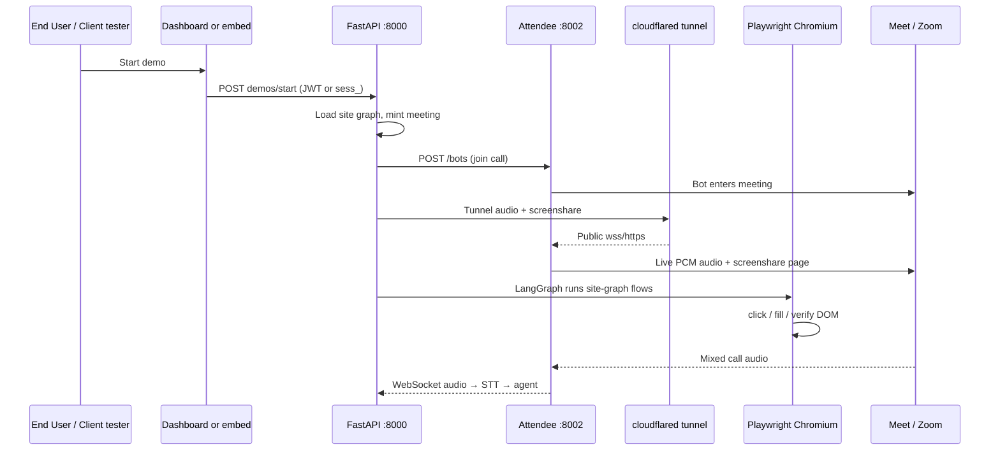

# Navigator AI

**B2B infrastructure by Resiliencesoft.** A Client company embeds Navigator on
*their* landing page. An End User clicks **"Start a demo"**, joins a video call,
and an AI agent drives the Client’s **real web product** in Chromium, narrates
out loud, and answers questions.

Navigator is invisible to the visitor. They see the Client’s product — not our
brand.

| Doc | Role |
|---|---|
| **[`docs/PRODUCT_MODEL.md`](docs/PRODUCT_MODEL.md)** | Standing product / auth / billing rules — **read before any change** |
| **This README** | Full project map + new-developer onboarding |
| [`docs/ONBOARDING.md`](docs/ONBOARDING.md) | Short pointer + live-demo sequence diagram |
| [`docs/PROJECT_STATUS.md`](docs/PROJECT_STATUS.md) | Phase history / status notes |
| `/docs` (API) | Live OpenAPI when the server is running |

---

## Table of contents

1. [What it does](#1-what-it-does)
2. [Three roles (vocabulary)](#2-three-roles-vocabulary)
3. [Test demo vs live demo](#3-test-demo-vs-live-demo)
4. [Architecture](#4-architecture)
5. [Repository layout](#5-repository-layout)
6. [Ports](#6-ports)
7. [New developer onboarding](#7-new-developer-onboarding)
8. [Day-to-day commands](#8-day-to-day-commands)
9. [Client dashboard](#9-client-dashboard)
10. [Site graphs, flows, explore](#10-site-graphs-flows-explore)
11. [Public API & SDK](#11-public-api--sdk)
12. [Self-hosting Attendee](#12-self-hosting-attendee)
13. [Meeting platforms](#13-meeting-platforms)
14. [Voice & knowledge](#14-voice--knowledge)
15. [Environment variables](#15-environment-variables)
16. [Auth boundaries](#16-auth-boundaries)
17. [VPS / mock-cloud setup](#17-vps--mock-cloud-setup)
18. [Coding workflow](#18-coding-workflow)
19. [Gotchas](#19-gotchas)
20. [Docs pipeline (Fern)](#20-docs-pipeline-fern)
21. [Costs & licensing](#21-costs--licensing)

---

## 1. What it does

End to end, one live demo:

1. Auth boundary sets `origin` from the credential (`dashboard_test` or
   `public_embed`) and resolves `product_id` from that credential only.
2. Load the right site graph revision (draft for test demos, **published** for
   live).
3. Create or reuse a meeting link (Google Meet open space, Zoom via ZAK, or a
   static Meet URL for local admit testing).
4. **Attendee** bot joins the call; **cloudflared** publishes local audio +
   screenshare endpoints so Attendee can reach this machine.
5. Playwright Chromium runs the Client’s site; LangGraph agent executes flows
   from the site graph (four tools only).
6. Gemini Live (or fallback) speaks; Groq Whisper listens on mixed meeting
   audio; ActionLog + decision traces land in SQLite.

The only product-specific artifact in core is the **site graph YAML** (plus
Client-owned bio/knowledge in the registry). Do not hardcode tenant names, URLs,
or flows into `navigator/app`, `navigator/agent`, `navigator/meeting`,
`navigator/voice`, or shared UI.

---

## 2. Three roles (vocabulary)

Use these words in code, docs, and UI:

| Role | Who | Touches |
|---|---|---|
| **Platform** | Resiliencesoft | Builds/operates Navigator. Not a tenant. |
| **Client** | Company that buys Navigator | Dashboard JWT, site graph, flows, knowledge, `nav_` key (server-side). Embeds SDK on their landing page. Scoped by `product_id`. |
| **End User** | Visitor on Client’s landing page | Never authenticates. Sees **"Start a demo"** then a live demo. Never sees dashboard / flow editor / site graph. |

Never call a Client an “end user”. Sample tenants (e.g. ResilioHub fixtures) live
only under config/fixtures/docs/examples — not as production defaults in core.

---

## 3. Test demo vs live demo

`origin` is set **at the auth boundary from the credential type** — never from a
request body — and is immutable after write.

| | Test demo | Live demo |
|---|---|---|
| `origin` | `dashboard_test` | `public_embed` |
| Trigger | Client, dashboard | End User, public embed |
| Auth | Dashboard JWT | `sess_` embed token (or `nav_` server-side) |
| Site graph | Latest revision (draft OK) | **Published revision only** |
| Billing / usage metrics | **No** | **Yes** |

Dashboard route: `POST /client/api/demos/start` → always `dashboard_test`.  
Public route: `POST /v1/demos/start` → always `public_embed`.

---

## 4. Architecture



**Agent loop (simplified):** listening → planning → speaking ↔ executing →
verifying. Four tools only: `click_element`, `fill_field`, `navigate`,
`wait_for`. Every tool call declares a postcondition; VERIFYING checks real DOM
(no LLM). Results go to ActionLog.

**Important modules:**

| Module | Job |
|---|---|
| `navigator/app/main.py` | HTTP entry; `_run_live_demo()` shared by test + live |
| `navigator/app/runner.py` | `DemoRunner` — in-process demo threads (`--workers 1`) |
| `navigator/app/registry.py` | Products, site graph revisions, publish/activate |
| `navigator/meeting/live_demo.py` | Join Meet/Zoom, tunnel, screenshare, agent loop |
| `navigator/meeting/attendee_stack.py` | Auto `docker compose up` for local Attendee |
| `navigator/meeting/tunnel.py` | cloudflared quick tunnel |
| `navigator/knowledge/site_graph.py` | YAML → typed graph (single validator) |
| `navigator/auth/` | Dashboard users, JWT, refresh cookies |

---

## 5. Repository layout

Code is organized **by feature** under `navigator/` (not by layer dumps):

| Path | Role |
|---|---|
| `navigator/core/` | `settings.py`, shared Pydantic schemas |
| `navigator/app/` | FastAPI, registry, demo runner |
| `navigator/auth/` | Dashboard auth store + JWT routes |
| `navigator/client/` | Buyer dashboard (`web/` React) + helpers |
| `navigator/agent/` | LangGraph demo conversation |
| `navigator/automation/` | Playwright tools, recorder, explore runner |
| `navigator/meeting/` | Attendee client, live demo, tunnels, Zoom ZAK |
| `navigator/voice/` | Live audio / STT / language switch |
| `navigator/knowledge/` | Site graphs, bio, briefs, Chroma memory |
| `navigator/logs/` | ActionLog + decision traces (SQLite) |
| `navigator/docs/` | Docs generator (HTML + Fern) from live code |
| `sdk/` | `@navigator/sdk` — authoring DSL + CLI |
| `scripts/` | Attendee sync, Zoom bootstrap, docker helpers |
| `docker/` | Compose overrides (e.g. Attendee voice agents) |
| `fern/` | Generated Fern project — **do not hand-edit** |
| `tests/` | pytest |

Do **not** reintroduce legacy packages (`navigator.api`, `navigator.config`,
`navigator.browser`, top-level `navigator.settings`).

---

## 6. Ports

| Port | Owner |
|---|---|
| **8000** | Navigator API + dashboard |
| **8001** | Attendee webpage-streamer (screenshare renderer) |
| **8002** | Attendee API / Django UI |
| **9000** | MinIO (Attendee local object store, if compose includes it) |

These three Navigator/Attendee ports are distinct and non-negotiable on a single
host.

---

## 7. New developer onboarding

### Prerequisites

- Linux (or WSL2), Python **3.11+**
- Node 20+ (dashboard UI builds)
- Docker + Compose v2 (for Attendee)
- `cloudflared` on `PATH` (or set `NAVIGATOR_TUNNEL_BIN`)
- API keys: Groq (STT/LLM), Gemini (Live audio + vision)

### 7.1 Clone and Python env

```bash
git clone <this-repo> Navigator_AI
cd Navigator_AI

python3 -m venv .venv
.venv/bin/pip install -U pip wheel
.venv/bin/pip install -e ".[dev]"
# Equivalent useful extras: .[api,voice,memory,llm,dev]
.venv/bin/python -m playwright install chromium
# System libs if prompted:
#   .venv/bin/python -m playwright install-deps chromium
```

### 7.2 Config

```bash
cp .env.example .env
```

Minimum for a **live Meet demo**:

| Variable | Why |
|---|---|
| `NAVIGATOR_GROQ_API_KEY` | STT + text LLM |
| `NAVIGATOR_GEMINI_API_KEY` | Live audio + vision |
| `NAVIGATOR_ATTENDEE_API_KEY` | Meeting bot API |
| `NAVIGATOR_CREDENTIAL_KEY` | Fernet key for product-login vault |
| `NAVIGATOR_MEETING_URL` | Only if using **static** Meet (host-admit) |

Generate a Fernet key:

```bash
.venv/bin/python -c "from cryptography.fernet import Fernet; print(Fernet.generate_key().decode())"
```

Set `NAVIGATOR_TUNNEL_BIN=cloudflared` (or an absolute path to the binary).
**Do not** leave a laptop-specific path if you sync `.env` to another machine.

### 7.3 Attendee (required for live demos)

Attendee is a **separate** repo — not vendored here.

```bash
git clone https://github.com/attendee-labs/attendee ~/projects/attendee
cd ~/projects/attendee
python3 init_env.py > .env
# Edit: POSTGRES_SSL_REQUIRE=false, DISABLE_EMAIL=true, SITE_DOMAIN=localhost:8002
# ALLOWED_HOSTS=*   (or include localhost,127.0.0.1)
# CHARGE_CREDITS_FOR_BOTS=false
# LAUNCH_BOT_METHOD must NOT be kubernetes for local compose screenshare
```

Sync Navigator’s voice-agent compose override, then bring the stack up:

```bash
cd /path/to/Navigator_AI
./scripts/sync-attendee-compose.sh

cd ~/projects/attendee
docker compose -f dev.docker-compose.yaml -f local.docker-compose.yaml \
  --profile webpage-streamer up -d --build
# First build is slow (tens of minutes).

docker compose -f dev.docker-compose.yaml -f local.docker-compose.yaml \
  exec -T attendee-app-local python manage.py migrate --noinput

# Bootstrap org + API key (prints NAVIGATOR_ATTENDEE_API_KEY=... once):
docker compose -f dev.docker-compose.yaml -f local.docker-compose.yaml \
  exec -T attendee-app-local bash -c 'python manage.py shell < bootstrap_local.py'
```

Paste the key into Navigator `.env` as `NAVIGATOR_ATTENDEE_API_KEY`.

Optional Zoom path:

```bash
cd /path/to/Navigator_AI
./scripts/sync-attendee-zoom-credentials.sh
```

Point Navigator at the clone if it is not `~/projects/attendee`:

```bash
NAVIGATOR_ATTENDEE_COMPOSE_DIR=/absolute/path/to/attendee
NAVIGATOR_ATTENDEE_BASE_URL=http://localhost:8002/api/v1
NAVIGATOR_ATTENDEE_AUTOSTART=1
```

Docker group:

```bash
sudo usermod -aG docker $USER   # then re-login
```

### 7.4 Dashboard UI build

Production serve uses the Vite build:

```bash
cd navigator/client/web
npm install
npm run build
```

Hot reload while editing UI (API must already be on `:8000`):

```bash
cd navigator/client/web && npm run dev
```

### 7.5 Start Navigator

```bash
cd /path/to/Navigator_AI
.venv/bin/uvicorn navigator.app.main:app --host 127.0.0.1 --port 8000 --workers 1
```

**Always `--workers 1`** — live demo state is in-process (`DemoRunner`).

Open **`http://127.0.0.1:8000/client`** (loopback-only by design).  
API docs: `http://127.0.0.1:8000/docs`.

On boot you should see:

```
[attendee] already up at http://localhost:8002/api/v1
# or: starting docker stack…
```

### 7.6 First login

- Sign up from the Auth screen (creates a tenant + blank published graph), **or**
- Use an existing dashboard user in `navigator.db` (`users` table).

Product login (credentials the agent uses on the Client’s site) is separate —
stored encrypted in `data/credentials.db`, not the dashboard password.

### 7.7 Smoke checklist

```bash
.venv/bin/python -m pytest -q
curl -sS -o /dev/null -w '%{http_code}\n' http://127.0.0.1:8000/docs
# Chromium
.venv/bin/python -c "from playwright.sync_api import sync_playwright
with sync_playwright() as p:
    b=p.chromium.launch(headless=True); page=b.new_page()
    page.goto('https://example.com'); print(page.title()); b.close()"
```

Dashboard → **Live demo** → prefer **Google Meet (new open space)** for
hands-free, or **Static Meet** if you will open the link and **admit** the bot.
Watch logs for:

```
[live] bot in meeting
[live] starting screenshare tunnel…
[audio] Attendee websocket connected
```

---

## 8. Day-to-day commands

```bash
# API
.venv/bin/uvicorn navigator.app.main:app --port 8000 --workers 1

# Do NOT use --reload during live Meet tests (reload kills the demo thread)

# Headless scripted demo (CI-style, no Meet)
.venv/bin/python -m navigator.demo --headless --mute

# Tests
.venv/bin/python -m pytest -q

# Attendee manual
cd ~/projects/attendee
alias adc='docker compose -f dev.docker-compose.yaml -f local.docker-compose.yaml'
adc --profile webpage-streamer up -d
adc --profile webpage-streamer ps
adc logs -f attendee-worker-local

# Docs regen (after API changes)
.venv/bin/python -m navigator.docs build
npx fern-api check

# Knowledge graph (local only — never commit graphify-out/)
graphify update .
```

Logs while developing: follow the uvicorn terminal. Useful prefixes:
`[attendee]`, `[live]`, `[tunnel]`, `[runner]`, `[audio]`, `[api]`.

---

## 9. Client dashboard

Served at `/client` from `navigator/client/web/dist/`. **Host must look like
loopback** (`localhost` / `127.0.0.1`) or the guard returns 403. For LAN access
to a remote box, put nginx in front and set `proxy_set_header Host 127.0.0.1:8000`
(see [§17](#17-vps--mock-cloud-setup)).

| Panel | File | Purpose |
|---|---|---|
| Auth | `AuthScreen.tsx` | Login / signup |
| Overview | `Overview.tsx` | Metrics, publish checklist |
| Live demo | `LiveDemo.tsx` | Test demos, product domain/login, autonomy |
| Flows | `Flows.tsx` | Playlist + recorder |
| Execution | `Execution.tsx` | Explore scope + mutation approvals |
| Site graph | `Editors.tsx` | YAML editor, demo script, publish |
| Knowledge / Bio | panels | Markdown KB + structured bio |
| Settings | `Settings.tsx` | Persona, languages, voice |
| Logs | `Logs.tsx` | Demo runs + ActionLog |
| Monitor | `ResourceMonitor.tsx` | Host CPU/RAM/health |

State: Zustand (`store.ts`). API client: `lib/api.ts` (JWT in memory, refresh
cookie).

---

## 10. Site graphs, flows, explore

- **Site graph** = pages → selector aliases → flows → postconditions.
- Callers pass **aliases**, never raw CSS, into tools.
- Single validator: `parse_site_graph` — used by file load, API upload, and SDK.

| | Manual record | Autonomous explore |
|---|---|---|
| Start | `POST /client/api/record/start` | `POST /client/api/explore/start` |
| Output | `list[RecordedStep]` | same |
| Merge | `merge_recorded_flow()` | same |
| Stored | draft (`publish=False`) | draft — **never auto-published** |

Draft vs published: `Registry.put_site_graph(..., publish=...)`,
`latest_revision()` (dashboard/test), `published_revision()` (live),
`activate()` / `POST /client/api/site-graph/publish`.

Fixtures under `navigator/knowledge/sites/` are for tests/samples — production
Clients own their graph in `registry.db`.

---

## 11. Public API & SDK

### Wrapper API (`/v1/*`)

```bash
# Register product (api_key shown once)
curl -sX POST localhost:8000/v1/products \
  -H 'Content-Type: application/json' -d '{"name":"Acme Inbox"}'

# Upload site graph
curl -sX PUT localhost:8000/v1/products/site-graph \
  -H "Authorization: Token $KEY" -H 'Content-Type: application/json' \
  -d "{\"yaml\": $(jq -Rs . < my_product.yaml)}"

# Headless verify-style demo (origin dashboard_test)
curl -sX POST localhost:8000/v1/demos \
  -H "Authorization: Token $KEY" -H 'Content-Type: application/json' \
  -d '{"page_id":"inbox","flow_id":"send_message"}'
```

Full route list: `/docs`. Tenant isolation: `product_id` from credential only;
each demo gets its own browser **context**.

### Embed

Public landing pages must **never** embed a `nav_` key. Mint a short-lived
`sess_` token server-side (`POST /v1/session-tokens`) and call
`POST /v1/demos/start`. See `navigator/client/embed/README.md`. Button copy is
exactly **"Start a demo."**

### SDK (`sdk/`)

```bash
cd sdk && npm install && npm run build && npm test
export NAVIGATOR_API_KEY=nav_... NAVIGATOR_BASE_URL=http://localhost:8000
npx navigator compile   # YAML only
npx navigator push      # upload revision
npx navigator verify    # run all flows; exit 1 on failure
```

Author flows in the Client’s own repo (`data-nav` attributes + typed DSL). The
server still validates via `parse_site_graph`.

---

## 12. Self-hosting Attendee

Cloud Attendee (`app.attendee.dev`) is paid; **self-host is free** and full
featured. Clone `attendee-labs/attendee` **outside** this repo.

```bash
sudo apt-get install -y docker.io docker-compose-v2
# cloudflared: release .deb or copy binary to ~/.local/bin / /usr/local/bin
```

**Always** use both compose files + the webpage-streamer profile:

```bash
docker compose -f dev.docker-compose.yaml -f local.docker-compose.yaml \
  --profile webpage-streamer up -d
```

Skipping `--profile webpage-streamer` → silent screenshare failure.  
Skipping `local.docker-compose.yaml` → Attendee binds `:8000` and collides with
Navigator.

Navigator may autostart this stack when
`NAVIGATOR_ATTENDEE_BASE_URL` is localhost and `NAVIGATOR_ATTENDEE_AUTOSTART=1`.

**Never** expose Attendee’s API or Django UI to Clients or End Users (Elastic
License 2.0). Only Navigator’s process talks to it.

---

## 13. Meeting platforms

| Platform | Behavior |
|---|---|
| **Google Meet (new space)** | Creates open room; `bot_first` — best hands-free path |
| **Zoom** | Navigator hosts via ZAK; needs Zoom OAuth in Navigator `.env` + Attendee project |
| **Static Meet** | Reuses `NAVIGATOR_MEETING_URL`; **you** are host and must **admit** the bot |

Bot never admits itself. Logs: `[live] bot in meeting` when join succeeds.
Static demos time out (~180s) if nobody admits.

Google Meet space creation needs a service account JSON + domain-wide
delegation (`NAVIGATOR_GOOGLE_SA_JSON`, `NAVIGATOR_GOOGLE_IMPERSONATE`).

---

## 14. Voice & knowledge

| Piece | Default |
|---|---|
| Voice | Gemini Live PCM (`Sulafat`) — no WAV TTS |
| STT | Groq Whisper on Attendee mixed-audio WebSocket |
| Languages | `NAVIGATOR_DEFAULT_SPOKEN_LANGUAGE` (`en` / `hi`); mid-call switch supported |
| Knowledge | Chroma at `NAVIGATOR_CHROMA_PATH` (first boot may download ONNX embed model ~80MB into `~/.cache/chroma`) |
| Bio | Structured fields per product |

On a new machine, copy `~/.cache/chroma` or allow one slow first readiness call
while the embedding model downloads — otherwise a single uvicorn worker can
appear “hung” on `/client/api/demo-readiness`.

---

## 15. Environment variables

See **`.env.example`** for the full commented list. Highlights:

| Variable | Purpose |
|---|---|
| `NAVIGATOR_HEADFUL` | `1` show browser; `0` headless (servers/VPS) |
| `NAVIGATOR_DB_PATH` / `NAVIGATOR_REGISTRY_DB` | SQLite paths |
| `NAVIGATOR_CHROMA_PATH` | Vector store dir |
| `NAVIGATOR_ATTENDEE_*` | Base URL, API key, autostart, compose dir |
| `NAVIGATOR_TUNNEL_BIN` | `cloudflared` binary |
| `NAVIGATOR_PUBLIC_BASE_URL` | Stable public origin (Zoom ZAK); empty → quick tunnel |
| `NAVIGATOR_MEETING_PLATFORM` / `NAVIGATOR_MEETING_URL` | Default platform / static link |
| `NAVIGATOR_GOOGLE_SA_JSON` / `NAVIGATOR_GOOGLE_IMPERSONATE` | Meet space creation |
| `NAVIGATOR_ZOOM_*` | Zoom Server-to-Server OAuth |
| `NAVIGATOR_GROQ_*` / `NAVIGATOR_GEMINI_*` | LLM / STT / Live audio |
| `NAVIGATOR_CREDENTIAL_KEY` | Product-login vault Fernet key |
| `NAVIGATOR_SCREENSHOT_QUALITY` | JPEG quality for screenshare (lower = less CPU) |
| `NAVIGATOR_JWT_SECRET` | Dashboard JWT signing |

Never commit real `.env` values.

---

## 16. Auth boundaries

| Credential | Prefix | Holder | Surface |
|---|---|---|---|
| API key | `nav_` | Client server-side only | `/v1/*` |
| Embed session | `sess_` | End User browser, single-use | `POST /v1/demos/start` |
| Dashboard JWT | Bearer + refresh cookie | Client operator | `/client/api/*` |

- `product_id` always from credential, never path/body.
- Dashboard loopback-only; not embeddable on public pages.
- Recorder + explorer require dashboard JWT (they drive a browser and write the
  graph). Explore WebSocket uses a short-lived ticket from an authed POST.

---

## 17. VPS / mock-cloud setup

Lean server pattern (LAN “cloud” box):

1. Sync project (code + `.env` + DBs + `chroma/` + `voices/` + `web/dist`).
   Keep remote `.venv` machine-local.
2. `NAVIGATOR_HEADFUL=0`, `NAVIGATOR_SCREENSHOT_QUALITY=50`.
3. Clone/sync Attendee under the same projects root, e.g.
   `~/dewashish_projects/attendee`, set
   `NAVIGATOR_ATTENDEE_COMPOSE_DIR` accordingly, `AUTOSTART=1`.
4. Install Docker, cloudflared; fix Attendee `ALLOWED_HOSTS=*`; migrate; run
   `bootstrap_local.py` for a **new** API key on that host.
5. `NAVIGATOR_TUNNEL_BIN=cloudflared` (fix any laptop absolute path).
6. Optional nginx on `:80` → `127.0.0.1:8000` with
   `proxy_set_header Host 127.0.0.1:8000` so `/client` passes the loopback
   guard; raise `proxy_read_timeout` (e.g. 300s) for slow Meet create.

```bash
cd ~/…/Navigator_AI
./run_server.sh   # uvicorn --host 0.0.0.0 --port 8000 --workers 1
# or: nohup ./run_server.sh > /tmp/navigator-uvicorn.log 2>&1 &
```

Dashboard users live in `navigator.db` (`users`). Resetting a password:

```bash
.venv/bin/python -c "import bcrypt,sqlite3; h=bcrypt.hashpw(b'Password', bcrypt.gensalt()).decode();
c=sqlite3.connect('navigator.db'); c.execute('UPDATE users SET password_hash=? WHERE email=?',(h,'user@user.com')); c.commit()"
```

---

## 18. Coding workflow

1. Read [`docs/PRODUCT_MODEL.md`](docs/PRODUCT_MODEL.md) before touching auth,
   `origin`, publish, or billing.
2. Put new code in the matching feature package (§5).
3. After `navigator/` Python edits: `graphify update .` (never commit
   `graphify-out/` or `graphify/`).
4. After API/route/model changes:
   ```bash
   .venv/bin/python -m navigator.docs build
   npx fern-api check
   ```
5. Prefer fixing shared helpers once over patching each caller.

| Task | Start here |
|---|---|
| New HTTP route | `navigator/app/main.py` |
| Demo lifecycle | `navigator/app/runner.py` |
| Agent behavior | `navigator/agent/nodes/` |
| Playwright tool | `navigator/automation/` |
| Meet / screenshare | `navigator/meeting/live_demo.py` |
| Dashboard UI | `navigator/client/web/src/panels/` |
| Spoken script | `navigator/knowledge/demo_script.py` |

Agent instructions for AI coding tools: `AGENTS.md` / `CLAUDE.md`.

---

## 19. Gotchas

| Symptom | Fix |
|---|---|
| `Attendee unreachable` | Compose up with both `-f` files + `--profile webpage-streamer`; check `COMPOSE_DIR` |
| `400 Voice agents are not enabled` | `./scripts/sync-attendee-compose.sh` then recreate Attendee stack |
| Bot stuck `joining` (static) | Admit as host, or use open Meet space / Quick access |
| Demo dies mid-start with `--reload` | Use plain uvicorn for live tests |
| Screenshare NXDOMAIN / Error 1033 | Tunnel dead or streamer DNS — see `tunnel.py`; keep draining cloudflared stdout |
| Zoom 400 credentials | Sync Zoom OAuth into Attendee project |
| `/client` → 403 from LAN IP | Need Host rewrite via nginx/SSH tunnel |
| Readiness hangs on new host | Chroma ONNX download blocking worker — wait or copy `~/.cache/chroma` |
| `tunnel binary not found` | Fix `NAVIGATOR_TUNNEL_BIN` (no foreign machine paths) |
| Duplicate uvicorn on one port | `pkill -f 'uvicorn navigator.app.main'` then start once |
| Test demos in billing | Should not — `origin=dashboard_test` excluded from `product_metrics()` |

---

## 20. Docs pipeline (Fern)

```bash
.venv/bin/python -m navigator.docs build   # refresh openapi + integration MDX + HTML
.venv/bin/python -m navigator.docs check   # fail if committed artifacts stale
npx fern-api check
```

| Output | Purpose |
|---|---|
| `docs/index.html` | Self-contained integration guide |
| `fern/openapi/openapi.yml` | Exact server schema |
| `fern/pages/integration.mdx` | Hosted narrative |

`tests/test_docs.py` regenerates and diffs — docs cannot silently drift.
Hand-editing generated Fern files is reverted by `docs check`.

---

## 21. Costs & licensing

**Typically free-tier capable:** Groq (LLM + Whisper), Gemini Flash / Live,
Chroma, Playwright, self-hosted Attendee.

**Paid / optional:** OpenAI reflect provider, Attendee cloud,
production Zoom/Meet quotas.

- **Attendee:** Elastic License 2.0 — do not offer Attendee itself as a hosted
  service to third parties; keep it behind Navigator.

---

## Quick reference card

```text
Navigator   http://127.0.0.1:8000/client     workers=1
API docs    http://127.0.0.1:8000/docs
Attendee    http://localhost:8002            + streamer :8001
Product law docs/PRODUCT_MODEL.md
Compose     ~/projects/attendee  (or NAVIGATOR_ATTENDEE_COMPOSE_DIR)
Tunnel      cloudflared on PATH
```

Welcome aboard. When in doubt: **PRODUCT_MODEL first**, then this README, then
the code paths in §4.
