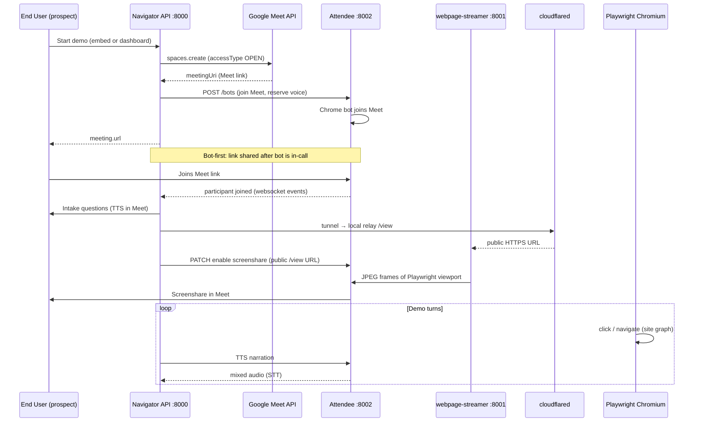

# Google Meet setup guide

How to configure Navigator AI so it **creates a new Google Meet link per demo**,
**joins the call automatically as the AI agent**, waits for the prospect (End
User) to join, then **shares its screen** and runs the live product walkthrough.

For general stack setup (Python, Docker, Attendee), see
[`ONBOARDING.md`](ONBOARDING.md). For business rules (test vs live demo, roles),
see [`PRODUCT_MODEL.md`](PRODUCT_MODEL.md).

---

## What you get when this works

| Step | Who | What happens |
|------|-----|--------------|
| 1 | Navigator API | Creates a **new instant Meet space** with open access (no knock / no host admit) |
| 2 | Attendee bot | Joins Meet **first** (`NAVIGATOR_LIVE_BOT_FIRST=1`), mic reserved, no screen yet |
| 3 | Console / API | Prints the Meet link — prospect joins and sees Navigator already in the call |
| 4 | Attendee | Streams call audio back to Navigator (STT) and plays TTS into the meeting |
| 5 | Navigator | Runs intake (name, company, what they want) over voice |
| 6 | Navigator + Attendee | Starts **cloudflared** tunnel → Attendee pulls `/view` as screenshare → Playwright drives the product |
| 7 | LangGraph agent | Executes site-graph flows while narrating; verifies each click before speaking |

This is the default **Google Meet** path. Zoom uses a different host model (ZAK
token); Meet does not need ZAK or `NAVIGATOR_PUBLIC_BASE_URL` for hosting.

---

## End-to-end flow (architecture)



**Why open access matters:** Navigator never implements “admit guest from lobby”.
Meet spaces are created with `accessType: "OPEN"` so the bot and the prospect can
both enter without a human host clicking Admit. That is a deliberate product
invariant (see `navigator/meeting/providers.py`).

**Why bot-first:** With `NAVIGATOR_LIVE_BOT_FIRST=1` (default), the prospect never
joins an empty room. Navigator is already present when they open the link.

---

## Components and why each is required

| Component | Why you need it |
|-----------|-----------------|
| **Google Workspace + domain** | Meet space creation via API requires a real Workspace user impersonated by a service account. Personal `@gmail.com` accounts cannot use domain-wide delegation for this flow. |
| **GCP service account + domain-wide delegation (DWD)** | A bare service account has no Meet of its own. DWD lets it act as your Workspace user and call `spaces.create` to mint a new link per demo. |
| **Attendee (self-hosted Docker)** | Navigator does not join Meet directly. Attendee runs a headful Chrome bot that joins the call, injects TTS audio, and publishes screenshare video from a URL. |
| **Attendee API key** | Authenticates Navigator → Attendee (`Authorization: Token …`). Stored as `NAVIGATOR_ATTENDEE_API_KEY`. |
| **webpage-streamer container** | Attendee service on `:8001` that fetches your public `/view` URL and turns it into Meet screenshare. Without `--profile webpage-streamer`, share silently fails. |
| **cloudflared** | Attendee runs in Docker and must reach Navigator’s local relay over the public internet. A quick tunnel exposes `http://127.0.0.1:<relay>/view` as `https://….trycloudflare.com/view`. |
| **Groq API key** | Speech-to-text for prospect answers in Meet (`whisper-large-v3-turbo`). Without it, intake falls back to stdin / scripted mode. |
| **TTS (Fish or Piper)** | Meet bot speaks via Attendee — needs WAV audio. Configure `NAVIGATOR_FISH_API_KEY` or Piper voice files. |
| **Playwright + site graph** | The shared “screen” is a real browser driving the Client’s product from YAML selectors/flows — not a static slide deck. |
| **Product login vault (optional)** | If the demo product needs login, save credentials in the dashboard (`NAVIGATOR_CREDENTIAL_KEY` required). |

### Optional: signed-in Google Meet bot

By default the Attendee bot joins Meet **as a guest** (`NAVIGATOR_GOOGLE_MEET_USE_LOGIN=0`).
That is enough when the room is **OPEN**.

Set `NAVIGATOR_GOOGLE_MEET_USE_LOGIN=1` only if you need a named Workspace avatar
or meetings that block anonymous joiners. That requires SAML SSO + Bot Logins in
the Attendee dashboard — see [Attendee signed-in bots](https://github.com/attendee-labs/attendee/blob/main/docs/signed_in_bots.md).
This guide focuses on the **guest + OPEN space** path (recommended to start).

---

## Prerequisites checklist

Before editing `.env`, confirm you have:

- [ ] **Python ≥ 3.11**, Navigator deps installed, Playwright Chromium
- [ ] **Docker Desktop** running (Windows/Mac) or Docker Engine (Linux)
- [ ] **Attendee repo** cloned (e.g. `~/projects/attendee`) and stack up on `:8002`
- [ ] **cloudflared** installed and on PATH (or set `NAVIGATOR_TUNNEL_BIN` to full path on Windows)
- [ ] **Google Workspace** admin access (for domain-wide delegation)
- [ ] **GCP project** where you can enable APIs and create service accounts
- [ ] **Groq** + **Fish** (or Piper) keys for voice

---

## Part 1 — Google Cloud: service account + Meet API

### 1. Enable the Meet API

1. Open [Google Cloud Console](https://console.cloud.google.com/) → your project.
2. **APIs & Services → Library** → search **Google Meet API** → **Enable**.

**Why:** Navigator calls `POST https://meet.googleapis.com/v2/spaces` to create
each demo room. Without this API, `create_meeting` returns 403/404.

### 2. Create a service account

1. **IAM & Admin → Service Accounts → Create service account** (any name, e.g. `navigator-meet`).
2. **Keys → Add key → JSON** → download the file.
3. Save it in the Navigator repo root as **`.navigator_google_sa.json`** (gitignored).

**Why:** This JSON is the credential Navigator uses to obtain OAuth tokens. Never
commit it; never expose it in client-side code.

### 3. Domain-wide delegation (Workspace Admin)

1. In GCP, open the service account → copy the **numeric Client ID** (not the email).
2. Open [Google Admin Console](https://admin.google.com/) → **Security → Access and data control → API controls → Domain-wide delegation**.
3. **Add new** → paste the Client ID.
4. OAuth scopes (exactly one):

   ```
   https://www.googleapis.com/auth/meetings.space.created
   ```

5. Authorize.

**Why:** Service accounts cannot create Meet spaces alone. DWD allows the SA to
impersonate a real Workspace user who “owns” the created space.

### 4. Choose the impersonated user

Pick an existing Workspace user email, e.g. `demo-bot@yourcompany.com`. This user
must exist in the same domain you delegated.

**Why:** Every `spaces.create` call runs as this user. They do not need to join
the call manually — Navigator only uses their identity for API access.

---

## Part 2 — Attendee (meeting bot)

Attendee is a **separate** repository. Navigator talks to it over HTTP.

### 1. Start the Docker stack

From the Attendee repo (adjust paths for your machine):

```bash
cd ~/projects/attendee
docker compose -f dev.docker-compose.yaml -f local.docker-compose.yaml \
    --profile webpage-streamer up -d
```

**Both `-f` files** are required when running alongside Navigator (Navigator uses
`:8000`, Attendee API on `:8002`, webpage-streamer on `:8001`).

Verify containers are up:

```bash
docker compose -f dev.docker-compose.yaml -f local.docker-compose.yaml ps
```

You should see at least: `attendee-app-local`, `attendee-worker-local`,
`attendee-webpage-streamer-local`, `postgres`, `redis`.

**Why webpage-streamer:** When Navigator PATCHes `screenshare_url`, Attendee’s
streamer fetches that HTTPS page and encodes it as Meet video. No streamer → no
share.

### 2. Create an account and API key

1. Open **http://localhost:8002/accounts/signup/** (not `:8000`).
2. Sign up and log in.
3. **Settings → API keys** → create a key.

**Why:** Every `POST /api/v1/bots` from Navigator requires `Authorization: Token <key>`.
After an Attendee DB reset, old keys stop working — generate a fresh one.

### 3. Windows gotchas

| Issue | Fix |
|-------|-----|
| Attendee email links say `:8000` | Open them on `:8002` (known dev settings quirk) |
| `bash\r` / exit 127 on worker | Use `local.docker-compose.yaml` with `entrypoint: []` overrides |
| webpage-streamer crash | Disable seccomp in `local.docker-compose.yaml` on Docker Desktop for Windows |
| `$` in `DJANGO_SECRET_KEY` | Quote the value and escape `$` as `$$` in Attendee `.env` |

---

## Part 3 — Navigator `.env` (Google Meet)

Copy from `.env.example` and set at minimum:

```env
# Platform — create new OPEN Meet per demo
NAVIGATOR_MEETING_PLATFORM=google_meet

# Service account (path or inline JSON)
NAVIGATOR_GOOGLE_SA_JSON=.navigator_google_sa.json
NAVIGATOR_GOOGLE_IMPERSONATE=demo-bot@yourcompany.com

# Guest bot (default). Set to 1 only after Attendee Bot Logins + SAML SSO.
NAVIGATOR_GOOGLE_MEET_USE_LOGIN=0

# Bot joins before prospect gets the link
NAVIGATOR_LIVE_BOT_FIRST=1

# Attendee
NAVIGATOR_ATTENDEE_BASE_URL=http://localhost:8002/api/v1
NAVIGATOR_ATTENDEE_API_KEY=your_token_from_attendee_dashboard

# Voice
NAVIGATOR_GROQ_API_KEY=...
NAVIGATOR_FISH_API_KEY=...          # or Piper via NAVIGATOR_PIPER_*
NAVIGATOR_TTS_PROVIDER=auto

# Tunnel for screenshare + audio websocket
NAVIGATOR_TUNNEL_BIN=cloudflared    # Windows: full path to cloudflared.exe

# Product demo (or configure in dashboard vault)
NAVIGATOR_CREDENTIAL_KEY=...        # Fernet key — required for saved logins
NAVIGATOR_PRODUCT_URL=https://your-product.example/login/
```

### Variables you do **not** need for Google Meet

| Variable | Used for |
|----------|----------|
| `NAVIGATOR_ZOOM_*` | Zoom only |
| `NAVIGATOR_PUBLIC_BASE_URL` | Zoom ZAK callback only |
| `NAVIGATOR_MEETING_URL` | `static` platform only (reuse one link) |

---

## Part 4 — Run and test

### 1. Start Navigator

```bash
.venv/bin/uvicorn navigator.app.main:app --port 8000 --workers 1
```

`--workers 1` is required — live demo state is in-process.

### 2. Dashboard test demo

1. Open **http://127.0.0.1:8000/client**
2. Log in → **Live Demo**
3. Platform: **Google Meet (new open space — recommended)**
4. Start test demo

**What to watch in logs:**

```
[live] Navigator joining meeting first (voice reserved; share after)…
[live] bot <id> created (joining)
[live] bot in meeting
[live] Navigator is ALREADY in the meeting.
[live]   https://meet.google.com/...
[live] starting screenshare tunnel…
[live] screenshare URL ready: https://….trycloudflare.com/view
[live] enabling screen share (holding start page)…
[live] screenshare_live=ok
```

5. Open the printed Meet link in another browser (or phone) — you are the prospect.
6. Confirm you hear Navigator, see screenshare, and the agent clicks through the product.

### 3. Public embed (live demos)

End Users trigger the same pipeline via `POST /v1/demos/start` with a `sess_`
token. The API creates the Meet space the same way; `origin` is `public_embed`
and the **published** site-graph revision is used. See
[`navigator/client/embed/README.md`](../navigator/client/embed/README.md).

---

## How each stage maps to code

| Stage | Module |
|-------|--------|
| Create Meet space (`OPEN`) | `navigator/meeting/providers.py` → `GoogleMeetProvider.create_meeting` |
| Start live demo thread | `navigator/app/main.py` → `runner.start_live` |
| Bot join + audio WS | `navigator/meeting/live_demo.py` + `navigator/meeting/attendee.py` |
| Tunnel + relay frames | `navigator/meeting/tunnel.py` + `navigator/meeting/relay.py` |
| Arm screenshare | `navigator/meeting/screenshare.py` → `arm_screenshare` |
| Agent graph | `navigator/agent/graph.py` |
| Playwright automation | `navigator/automation/browser/*` |

---

## Troubleshooting

| Symptom | Likely cause | Fix |
|---------|--------------|-----|
| `could not create meeting: NAVIGATOR_GOOGLE_SA_JSON is unset` | Missing SA file | Save JSON to `.navigator_google_sa.json`, set env var |
| `Google SA token failed` / 403 | DWD not configured or wrong scope | Re-check Client ID + `meetings.space.created` in Admin |
| `Attendee unreachable at localhost:8002` | Docker stack down | Start Attendee compose with both `-f` files |
| `Attendee POST /bots -> 401` | Bad API key | New key from Attendee dashboard after DB reset |
| Bot joins but no voice | Missing TTS or Fish/Piper misconfigured | Check TTS warm log; verify `NAVIGATOR_FISH_API_KEY` |
| Intake never hears you | No Groq key or audio tunnel failed | Check `[live] audio websocket ready` and Groq key |
| `DNS_PROBE_FINISHED_NXDOMAIN` in share | webpage-streamer cannot resolve tunnel host | Ensure streamer container running; see `tunnel.py` DNS check |
| `screenshare_live=timeout` | Tunnel not reachable from Docker | Confirm cloudflared running; retry; check firewall |
| Bot stuck “waiting to join” | Meet not OPEN or org blocks guests | Confirm `google_meet` platform (not `static`); try signed-in bot |
| Prospect must admit bot | Using static link or restricted Meet | Use `google_meet` platform so API sets `accessType: "OPEN"` |

---

## Security reminders

- **Never** put `nav_` API keys or service-account JSON in frontend / embed code.
- **Never** commit `.navigator_google_sa.json` or `.env`.
- Dashboard (`/client`) is **loopback-only** — not embeddable on public sites.
- Public embed uses short-lived `sess_` tokens scoped to one demo.

---

## Quick reference — minimum path to first Meet demo

1. GCP: enable Meet API → SA JSON → DWD with `meetings.space.created`
2. Attendee: Docker up with `webpage-streamer` → signup on `:8002` → API key
3. Navigator `.env`: `google_meet`, SA path, impersonate email, Attendee URL + key, Groq + TTS
4. Install **cloudflared**
5. `uvicorn … --workers 1` → dashboard **Live Demo** → join printed link → verify voice + screenshare

When all five are green, Navigator creates the Meet link, joins automatically,
waits for the client, shares the screen, and runs the agent — no manual host
admit step required.
