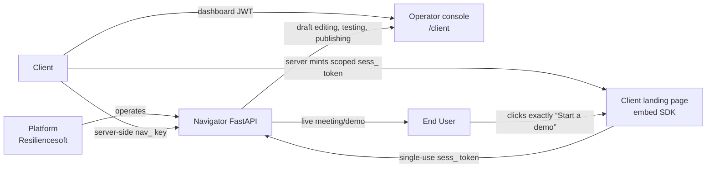
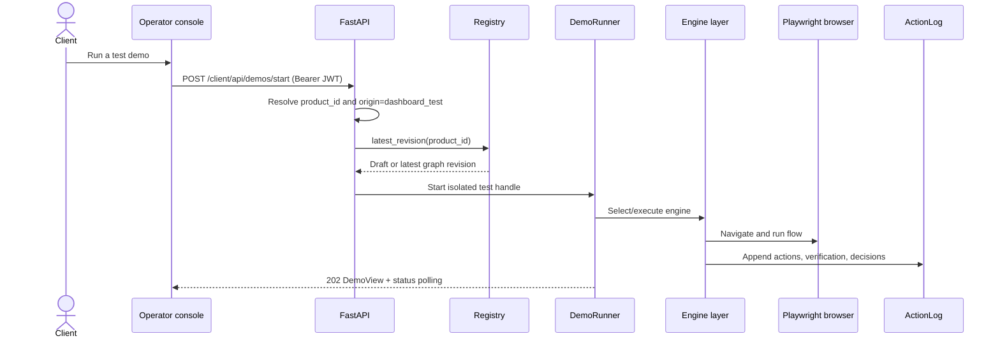
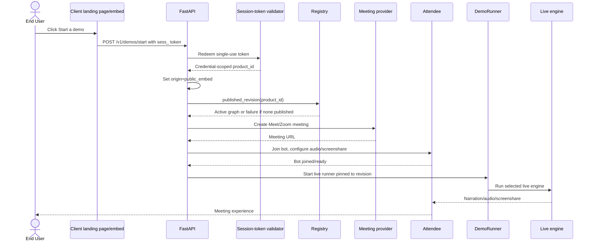
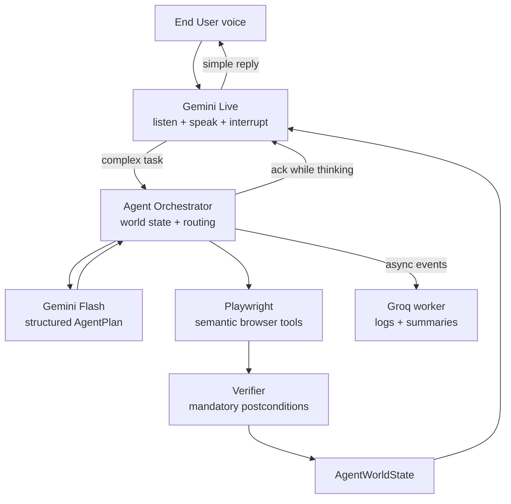
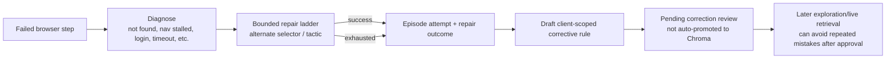

# Navigator AI — High-Level Design

## 1. Purpose and current product

Navigator AI is a multi-tenant demo-as-a-service platform operated by Resiliencesoft. A Client company registers its product, supplies credentials and a site graph, and embeds a small “Start a demo” control on its own landing page. An End User clicks that control and receives a live AI-run demonstration of the Client’s real product. Navigator is infrastructure: the visitor should see the Client’s product and meeting experience, not a Platform-branded consumer surface.

This document describes the implementation present in the repository. Statements marked **Planned / Not Yet Implemented** describe the forward-looking autonomy/readiness roadmap, not shipped behavior.

## 2. Roles and trust boundaries



- **Platform** builds and operates the service. It is not a tenant.
- **Client** is the tenant, scoped by credential-derived `product_id`. It owns the site graph, flows, knowledge, credentials, and publish decision.
- **End User** never authenticates and never reaches the dashboard, editor, site graph, or corrections queue.

## 3. System architecture

```mermaid
flowchart TB
    subgraph ClientSurfaces[Client-owned surfaces]
        LAND[Product landing page]
        SDK[TypeScript/public embed script]
        CONSOLE[Vite + React operator console]
    end

    subgraph Navigator[Navigator AI]
        API[FastAPI backend\nroute/auth boundary]
        REG[Registry\nproducts + graph revisions]
        RUN[DemoRunner\nthread + browser isolation]
        RUNTIME[Agent runtime\nOrchestrator + World State]
        PLAYBACK[Deterministic playback\ntimeline | strict playlist]
        LEGACY[LangGraph adapter\nmigration path]
        EXP[Autonomous explorer\nPlaywright + guardrails]
        KNOW[Knowledge + retrieval\nsite graph, Chroma, Product Map]
        LOG[SQLite ActionLog\ndecisions + demo runs]
        REDIS[(Redis\ndemo state + pub/sub)]
        ATT[Attendee adapter\nMeet / Zoom bot]
        RELAY[Relay + cloudflared\naudio / screenshare / avatar pages]
    end

    subgraph Providers[External providers]
        GROQ[Groq\nasync event enrichment + legacy STT]
        OPENAI[OpenAI\nGPT-4o-mini reflection\nGPT-4o vision fallback]
        GEMINI_LIVE[Gemini Live\nrealtime audio in/out]
        GEMINI_FLASH[Gemini Flash\nplanning + DOM reasoning]
        MEET[Google Meet]
        ZOOM[Zoom]
    end

    LAND --> SDK --> API
    CONSOLE --> API
    API --> REG
    API --> RUN
    API --> EXP
    API --> KNOW
    RUN --> REDIS
    RUN --> LOG
    RUN --> RUNTIME
    RUN --> PLAYBACK
    RUN --> LEGACY
    RUNTIME --> RELAY
    RUNTIME --> ATT
    PLAYBACK --> RELAY
    LEGACY --> RELAY
    EXP --> KNOW
    EXP --> LOG
    RUNTIME --> GEMINI_LIVE
    RUNTIME --> GEMINI_FLASH
    RUNTIME --> GROQ
    LEGACY --> GROQ
    LEGACY --> OPENAI
    LEGACY --> GEMINI_FLASH
    ATT --> MEET
    ATT --> ZOOM
    RELAY --> ATT
```

| Component | Current responsibility |
|---|---|
| FastAPI backend | Tenant registration, auth boundaries, graph revisions, demos, recorder/explorer, corrections, metrics, and operator APIs. |
| Operator console | Client dashboard for onboarding, site graph/flow editing, recording, autonomous exploration, test demos, readiness, logs, and settings. |
| Embed script and SDK | Server-minted `sess_` token flow for public demos; TypeScript DSL/CLI for authoring and pushing graphs. |
| Registry | SQLite product registry and immutable site-graph revisions; `latest_revision()` for dashboard/test and `published_revision()` for live. |
| DemoRunner | Per-demo Playwright context, thread, `CallDeps`, lifecycle handle, run persistence, and optional Redis synchronization. |
| Agent runtime | **Primary interactive path.** Gemini Live (ears/mouth) → Orchestrator (world state, routing, locks) → Gemini Flash (planning) → Playwright (body) → verification → world state. Groq enriches events asynchronously. |
| Deterministic playback | Timeline and strict playlist replay recorded flows without LLM planning. Fallback when Live is unavailable or for authored narrated demos. |
| LangGraph adapter | Legacy conversational state machine; nodes migrate incrementally into the runtime. Still used where the orchestrator is disabled or for test demos without Live. |
| Autonomous explorer | Bounded browser exploration using click/fill/navigate/wait tools, field classification, guardrails, semantic labeling, repair, episodes, and draft-flow generation. |
| Knowledge/memory | Site graph validation, product brief/bio, flow semantics, Chroma collections, pending corrections, and Product Map persistence. |
| Attendee and relay | Joins meetings, transports mixed audio, publishes screenshare/relay pages, and supports Meet/Zoom-specific behavior. |

## 4. Demo modes

`origin` is explicit and assigned at the authentication boundary. It is never read from the request body and is immutable after the run row is created.

| Mode | Trigger/auth | Revision | Usage |
|---|---|---|---|
| Test demo | Client dashboard, JWT; also server-side `nav_` verify route | Latest revision, including a draft | Non-billable |
| Live demo | End User public embed, single-use `sess_` token; server-side `nav_` public start is also supported | Published revision only | Billable |

### Test demo flow



### Live demo flow



## 5. Interactive agent runtime (primary)

The live demo path is a **real-time multimodal agent system**, not a single model doing everything. Two Gemini model contracts are intentional: **Gemini Live** (`gemini-3.1-flash-live-preview`) for realtime audio, and **Gemini Flash** (configurable; default `gemini-3.6-flash`) for deep planning. They are not interchangeable — Live has no substitute for Flash planning, and Flash has no Live API.



| Component | Responsibility |
|---|---|
| Gemini Live | Realtime audio in/out, listening, speaking, interruption, simple replies, compact DOM context |
| Orchestrator | Source of truth: session, task, action lock, cancellation, model routing, event emission |
| AgentWorldState | Canonical runtime state: conversation, browser, task, execution, agent mode, interruption, memory |
| Gemini Flash | Deep reasoning: planning, DOM analysis, screenshot escalation, recovery strategy |
| Groq (async) | Event enrichment: human-readable traces, summaries, memory candidates — **not on the critical click path** |
| Playwright | Semantic actions (`click`, `type`, `navigate`, …) resolved to site-graph aliases or inventory labels |
| Verifier | Mechanical postcondition checks after every action; vision escalation when ambiguous |

**Simple vs complex routing:** Live handles acknowledgements, short questions, and conversational replies. Utterances that require browser reasoning route to the orchestrator. Live speaks an immediate acknowledgement while Flash plans in parallel.

**Interruption model:** `CANCEL_AFTER_ATOMIC_ACTION` — finish the current browser action, verify, then cancel the remaining plan and start the new task. Live can respond immediately while the runtime completes the atomic step safely.

**DOM context:** A DOM State Builder produces a compact representation for Live (visible labels, page, URL) and a detailed inventory for Flash. Raw DOM is not streamed continuously into Live.

## 5b. Deterministic playback (fallback)

Timeline and strict playlist are **playback subsystems**, not competing intelligence engines:

| Mode | Role |
|---|---|
| `timeline` | Replays recorded narration and timed cursor actions with smooth pacing |
| `strict_playlist` | Deterministic YAML replay when timeline metadata is incomplete |

LangGraph remains a **migration adapter** for conversational test demos and nodes not yet ported to the runtime. Runtime selection still reports diagnostic labels (`gemini_live`, `timeline`, `strict_playlist`, `langgraph_conversational`) for observability.

## 5c. Legacy engine layer (migration)

Previously four engines competed as equal architectures. The target state collapses to:

- **InteractiveAgentRuntime** — Live + Orchestrator + Flash + Playwright (primary)
- **DeterministicPlaybackRuntime** — timeline + strict playlist

The old four-engine table is retired in favor of the split above. LangGraph nodes migrate incrementally via an adapter; the graph is no longer the product architecture.

## 6. Autonomy and self-healing

The implemented autonomous path accepts a product URL and stored credentials, explores with bounded budgets, refuses risky actions through keyword plus LLM guardrails, pauses on business-specific fields, and merges generated `RecordedStep` values into an unpublished draft through the same merge path as manual recording.



Exploration episodes are durable JSONL/JSON artifacts with capped screenshots and retention. Live-call failures are persisted through ActionLog and reflection/correction storage. Learning is review-gated: exploration learning writes pending rules rather than silently changing the trained correction collection.

## 7. Technology choices

| Component | Technology | Why chosen |
|---|---|---|
| HTTP/API | FastAPI + Pydantic | Typed contracts, dependency-based auth, REST and WebSocket support. |
| Dashboard | Vite + React + TypeScript | Fast local operator console with typed API calls and focused panels. |
| Browser automation | Playwright Chromium | Real product interaction, isolated browser contexts, DOM verification, screenshots, and CDP screencast. |
| Orchestration | Agent Orchestrator + World State (LangGraph adapter during migration) | Single authoritative runtime state; explicit event log; testable contracts |
| Live interface | Gemini Live (`gemini-3.1-flash-live-preview`) | Native realtime audio; replaces external STT/TTS on primary live path |
| Deep reasoning | Gemini Flash (`NAVIGATOR_BRAIN_REASONING_MODEL`) | Structured plans, DOM analysis, function calling / JSON outputs |
| Legacy planning | Groq Llama 3.3 70B | LangGraph paths and explore; async event enrichment in runtime |
| Reflection | OpenAI GPT-4o-mini | Cost-conscious post-failure correction drafting |
| Vision fallback | OpenAI GPT-4o and Gemini Vision | Visual interpretation when DOM verification is ambiguous |
| Legacy STT | Groq Whisper | Non-Live paths and fallback during migration |
| Meeting transport | Attendee adapter | Meet/Zoom joining; audio WebSocket; screenshare — infrastructure only |
| Vector memory | ChromaDB | Product-scoped semantic retrieval for knowledge and approved corrections. |
| Shared demo state | Redis hashes, TTLs, and pub/sub | Cross-worker visibility and stop propagation. |
| Durable relational data | SQLite/WAL | Simple append/read workloads for registry, logs, runs, users, and pending corrections. |
| Public authoring | TypeScript SDK + Fern schema | Typed DSL and CLI now; generated Fern client remains stubbed. |

## 8. Tenancy and scaling

The primary tenant key is `product_id`, derived from the credential. Route paths and request bodies cannot select another tenant. Registry, ActionLog, Chroma collection names, credentials, flows, episode paths, and dashboard dependencies all scope reads by that key.

Each demo owns its Playwright browser context, `CallDeps`, thread, and stop event. The current runner maintains a local `_demos` dictionary for fast polling. With Redis configured, it also serializes handles under per-product hashes and per-demo keys with 24-hour TTLs, records a worker owner, and uses worker-specific pub/sub channels for remote stop requests. Other workers can read Redis state and merge it with their local handles.

This removes the single-process visibility bottleneck for reads and stop control, but it is not a fully distributed job scheduler: the browser and execution thread remain owned by one worker, and the local cache remains part of the implementation. SQLite is also the current durable store; PostgreSQL is a future deployment consideration noted in code comments.

## 9. Integrations and failure behavior

| Dependency | Responsibility | Current failure behavior |
|---|---|---|
| Groq Llama / Whisper | Legacy LangGraph planning, explore, optional STT; runtime async event enrichment | Provider/key failures use fallback paths; runtime continues if Groq enrichment is down |
| Gemini Live | Realtime audio interface for live demos | Live unavailable → timeline/strict playlist/LangGraph fallback |
| Gemini Flash | Agent runtime deep planning (`navigator/agent_runtime`) | Missing key disables complex task path; Live still handles simple replies |
| OpenAI GPT-4o-mini / GPT-4o | Reflection and vision fallback | Reflection is fail-soft; visual fallback is optional |
| Attendee | Meeting transport only (audio WebSocket, screenshare) | Live start fails early if Attendee is unreachable |
| Google Meet / Zoom | End-user meeting surface | Provider-specific creation/join/authentication errors prevent a live session from starting. |
| cloudflared | Makes local audio/screenshare relay reachable by Attendee | Tunnel/DNS readiness is probed and retried; screenshare may continue after timeout with a warning. |
| ChromaDB | Product-scoped semantic memory | Retrieval is optional/fail-soft in several paths; collection names enforce tenant separation. |
| Redis | Shared state and stop pub/sub | Without Redis the runner falls back to process-local state; multi-worker coordination is not equivalent. |

## 10. Non-functional considerations

### Voice latency

Primary live path: **Gemini Live audio in → Live → Gemini Live audio out**. No external STT/TTS on the critical conversational seam when Live is active. Complex browser tasks acknowledge immediately via Live while Flash plans asynchronously.

Measure separately: Live first-response latency, Flash planning start, first browser action, action→verification, and Attendee transport. No formal end-to-end SLO is defined yet; establish baselines before declaring migration complete.

### Security

- Dashboard routes require a JWT bound to a tenant product.
- Public browsers receive only single-use, short-lived `sess_` tokens.
- `nav_` keys are intended for server-side use and are hashed in the registry.
- `product_id` is credential-derived.
- Public live demos use published revisions only.
- The client-side embedding design is still incomplete: the current minimal script accepts a token in a data attribute, while safe server-side session-token minting and deployment/CORS policy require product integration. Never put a `nav_` key in browser HTML or JavaScript.

### Current limits

- Browser/meeting workers are still tied to the process that owns them.
- SQLite is not the intended high-concurrency durable store.
- Redis is optional and the local cache remains active.
- Attendee, Zoom, tunnel, and external LLM availability directly affect live readiness.
- The 3D avatar asset/relay exists, but it is not yet appearing reliably in the Meet video feed.

## 11. Planned architecture — Planned / Not Yet Implemented

The larger autonomy roadmap builds on the shipped semantic labeling and retrieval work:

1. **Phase B1 — flow auto-segmentation:** split long exploration traces into coherent demo flows automatically, with Client review before activation.
2. **Phase B2 — episode history read-back:** feed prior episode outcomes and successful repair tactics directly into later exploration decisions.
3. **Phase B3 — automatic Product Map:** derive and maintain a product-area map from explored flow semantics, with retrieval and dashboard review. Product Map storage/helpers exist, but the complete automatic workflow is not treated as shipped here.
4. **Phase C — guarded VLM selector repair:** use visual selector repair only as a bounded fallback after DOM/selector tactics fail; preserve destructive-action guardrails and human review.
5. **Phase D — readiness verdicts:** score each flow as `ready`, `needs_review`, or `broken`, with financial/destructive flows never eligible for `ready`. Publishing remains an explicit human action.

These phases must preserve the existing origin, revision, tenant, billing, and role boundaries. No autonomous flow may become live merely because it was generated or repaired.

## 12. Known open questions

- Should the Gemini Live engine be audited for the same `SPEAKING`/`EXECUTING` desynchronization recently addressed in LangGraph?
- What production-safe pattern will mint embed sessions without exposing a long-lived API credential or creating an uncontrolled cross-origin token surface?
- Can Attendee’s Zoom screenshare path be made reliable enough for a live SLO?
- How should the 3D avatar be attached so it appears in the Meet video feed rather than only in a local/relay page?
- When should Redis become mandatory, and what durable job/ownership mechanism should replace process-owned browser threads at larger scale?
- Which current tests should be updated as stale fixtures/specs, and which indicate real regressions after Attendee readiness is mocked correctly?
