# Navigator AI — Low-Level Design

## 1. Implementation map

The repository is organized by feature rather than a strict controller/service/repository layering.

### `navigator/app`

`main.py` constructs the FastAPI application and exposes product, site-graph, demo, dashboard, recorder, explorer, knowledge, readiness, metrics, and correction routes. It wires dependencies for `Registry`, `ActionLog`, `DemoRunner`, credential vaults, providers, and dashboard authentication. `runner.py` owns demo handles and background execution. `registry.py` stores products and immutable graph revisions in SQLite. `state.py` / `state_store.py` provide Redis-backed serializable demo state; the codebase contains both names, so the exact canonical module should be clarified during cleanup. `system_health.py` and `token_usage.py` expose operational data.

### `navigator/auth`

JWT login, refresh/logout, user preferences, auth stores, dependency functions, and session-token mint/redeem behavior live here. Dashboard dependencies derive the tenant product from the JWT and reject missing/invalid bearer credentials.

### `navigator/core`

Shared Pydantic schemas, settings, provider key pools, usage context, and provider-specific configuration. The core schemas define tool calls, postconditions, results, and action-log payloads.

### `navigator/agent_runtime`

**Primary interactive runtime** (shipped on `feat/self-healing-explore`). Replaces the “Live does everything” and four-engine model with a single orchestrated path:

| Module | Role |
|---|---|
| `models.py` | Typed contracts: `AgentSession`, `AgentWorldState`, `AgentTask`, `AgentPlan`, `AgentAction`, `AgentEvent`, … |
| `orchestrator.py` | Central brain: routing, execution lock, task lifecycle, event emission |
| `world_state/store.py` | Authoritative in-process world state with versioned updates |
| `events/bus.py` | Synchronous event bus; Groq worker subscribes asynchronously |
| `dom/builder.py` | Compact DOM for Live; detailed inventory for Flash |
| `planning/router.py` | Simple vs complex utterance classification |
| `planning/flash_planner.py` | Gemini Flash structured plan generation |
| `planning/groq_worker.py` | Async log/summary enrichment (non-critical) |
| `execution/executor.py` | Semantic action → `ToolCall` → Playwright |
| `execution/cancellation.py` | Atomic-action interruption semantics |
| `verification/verifier.py` | Wraps mechanical postcondition results |
| `adapters/live_adapter.py` | Push DOM context and acknowledgements to Live |
| `bridge.py` | Wire orchestrator into `CallDeps` and live demo |

Settings: `NAVIGATOR_AGENT_RUNTIME_ENABLED` (default true), `NAVIGATOR_BRAIN_REASONING_MODEL`.

Runtime sequence for a complex live utterance:

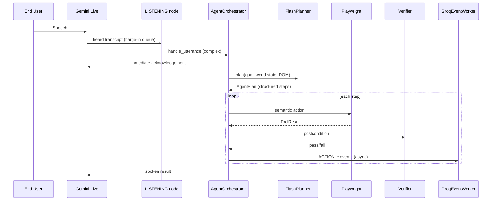

### `navigator/agent`

The conversation/execution system. `graph.py` builds the LangGraph state machine. `state.py` defines `CallState` and `CallDeps`. `nodes/` contains joining, introducing, listening, planning, speaking, executing, verifying, reflecting, and ending nodes. `recorded_playback.py` contains timeline and strict playlist execution. `turn_brain.py`, `planner.py`, `live_input.py`, `call_memory.py`, and `demo_trace.py` support interactive decisions and diagnostics.

### `navigator/automation`

Playwright browser sessions, recorder, cursor, login gates, DOM tools, verification, narration capture, external-link handling, and autonomous exploration. `automation/explore` contains perception, reasoning, field classification, guardrails, segmentation/semantics, diagnosis, repair, episode persistence, learning, validation, and exploration session control.

### `navigator/meeting`

Meeting provider factories and Meet/Zoom implementations, Attendee HTTP client/stack management, audio bridge, relay pages, cloudflared tunnels, screenshare readiness, meeting intake, leave/grace handling, and the live demo pipeline.

### `navigator/voice`

STT (legacy non-Live paths), live persona, and the Gemini Live adapter. When Live is active, **audio in/out is native to Live** — external STT/TTS is not on the critical path. The live agent exposes a speaker-compatible interface consumed by the meeting/live-demo layer.

### `navigator/knowledge`

Site graph parsing/validation, product briefs and bios, flow triggers, demo-script composition, hybrid retrieval, Chroma collections, pending corrections, semantic context, Product Map persistence, and published knowledge indexes.

### `navigator/logs`

`store.py` owns append-only ActionLog entries, `demo_runs`, token usage, product metrics, and failure queries. `decisions.py` stores decision traces. `host_meta.py` captures runtime metadata.

### `navigator/client/web` and `navigator/client/embed`

The dashboard is a Vite/React SPA with panels for onboarding, overview, flows, editors, execution, live test demos, exploration, logs, settings, and resource monitoring. The embed script is a minimal browser-side button that sends a session token to `/v1/demos/start`. The separate `sdk/` package contains the TypeScript DSL, compiler, hand-written API client, CLI, and Fern generation placeholder.

### `tests`, `scripts`, `docker`, and `fern`

`tests/` covers route contracts, auth, registry, graph validation, engines, browser tools, meeting adapters, voice, memory, exploration, and dashboard behavior. `scripts/` and `docker/` support Attendee, avatar, Zoom, local recording, and development setup. `fern/` contains generated/API-description inputs and is not hand-edited.

## 2. LangGraph state machine

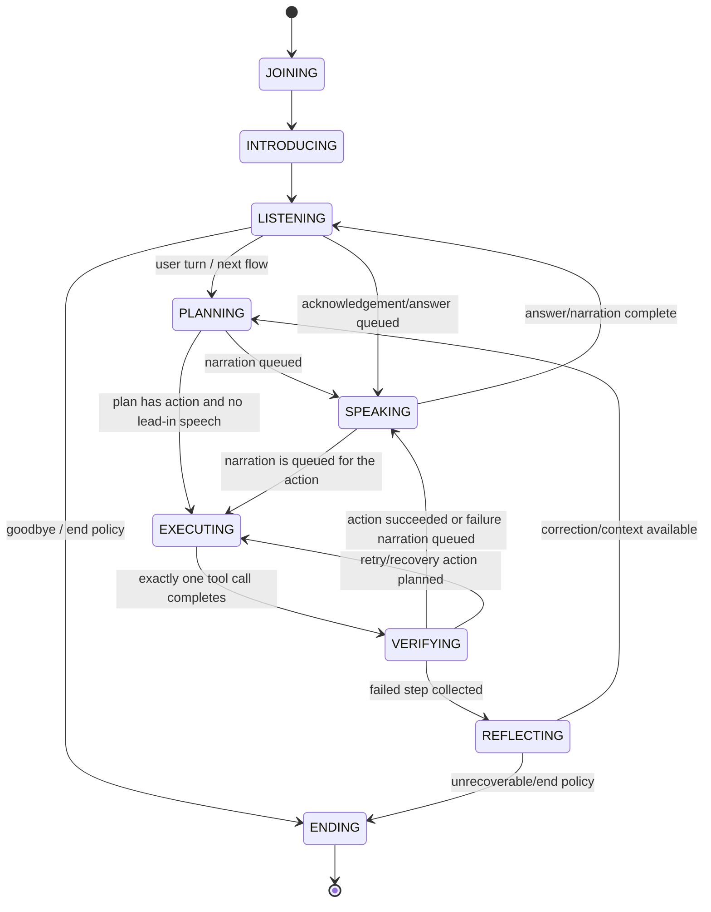

`SPEAKING` owns TTS. Planning can queue pre-action narration, but execution consumes one action at a time and verification checks the declared postcondition against the real DOM. A recent LangGraph fix keeps lead-in narration queued until the corresponding execution pass instead of allowing the cursor action to get ahead of speech. `VERIFYING` is mechanical where possible: it resolves selectors/URLs/text/visibility/value checks without asking an LLM to decide whether the DOM changed.

## 3. Other engine state machines

### Gemini Live

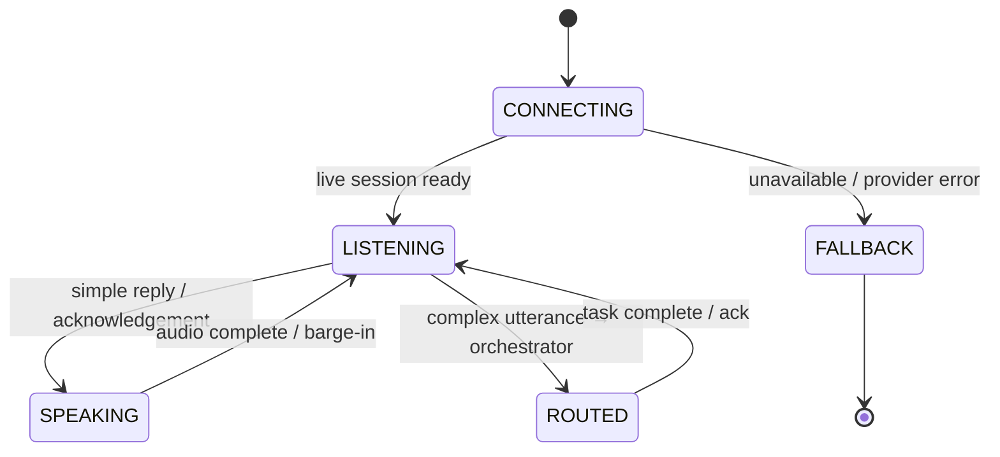

Gemini Live owns the **realtime interface** only: audio, immediate replies, interruption, and compact DOM awareness. Browser planning and execution go through `AgentOrchestrator` → Flash → Playwright. Live speaks acknowledgements while Flash plans (`"Sure — let me check that for you."`).

### Timeline

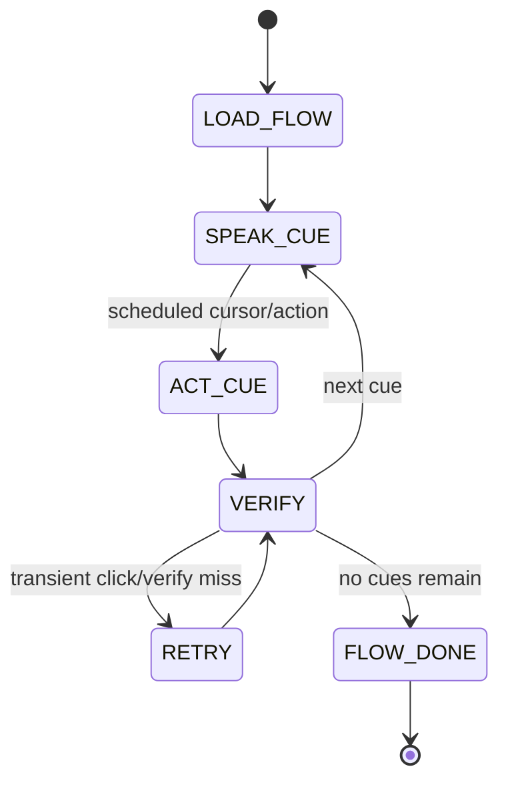

Timeline playback uses recorded narration windows, click timings, cursor paths, and flow metadata. It is paced playback rather than open-ended planning; dashboard tests may continue after selected click/verification misses while live readiness remains stricter.

### Strict playlist

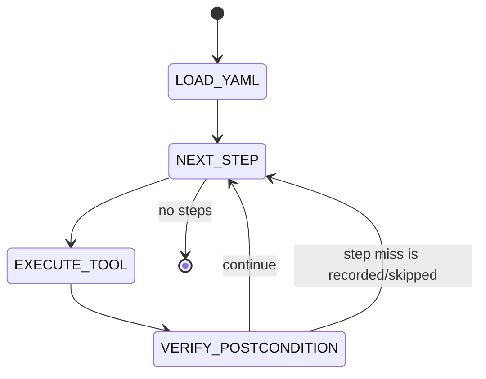

Strict playlist is deterministic YAML replay without LLM planning or timeline metadata. It exists so a playlist with incomplete narration/timing can still execute. It differs from timeline by having no scheduled speech/action overlap and from LangGraph by having no conversational detours.

### LangGraph conversational variant

When a playlist is absent or timeline metadata is unusable, the same LangGraph graph handles conversational flow selection, planning, tool execution, verification, reflection, and end policy. `langgraph_conversational` is an engine-selection diagnostic label; the implementation remains the LangGraph graph.

## 4. Core data model

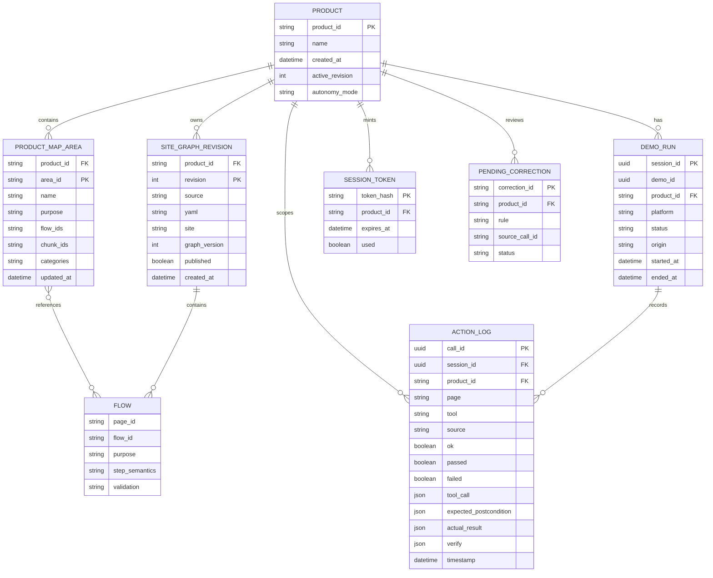

### Field-level behavior

- **Product:** tenant identity and active revision pointer. `product_id` is credential-derived at request time.
- **SiteGraphRevision:** exact uploaded YAML, source provenance (`yaml`, `recorded`, `explored`, or `sdk`), graph version, and publication state. Uploads append revisions; activation changes the live pointer.
- **Flow:** logically represented inside site-graph YAML, with page/flow identifiers, tool steps, postconditions, narration metadata, `_meta.semantics`, and optional `_meta.validation`.
- **DemoRun:** durable billing/audit record. `origin` is required conceptually and must not be changed by later status upserts.
- **ActionLog:** one row per tool call with expected and actual outcomes. `failed` is denormalized for reflection queries. Product metrics exclude sessions whose `demo_runs.origin` is `dashboard_test`.
- **Product Map:** SQLite area records with purposes and linked flow/chunk IDs. The persistence model exists; full automatic generation is part of the planned roadmap.
- **Session token:** short-lived, single-use public credential scoped to one product. The public route redeems it and sets `public_embed`.
- **Episode history:** not a relational table. Each explore run is stored under `{explore_root}/{product_id}/{job_id}/` with `attempts.jsonl`, `episode.json`, and capped JPEG shots. Successful repair tactics and unrepaired failures are summarized for learning.
- **Redis demo state:** serialized `DemoHandle` JSON is stored at `demo:{demo_id}` with a 24-hour TTL and indexed in `demos:product:{product_id}`. Ownership is `demo_owner:{demo_id}`. Stop requests publish to `demo:stop:{worker_id}`.

## 5. API contract summary

### Public/server API routes

| Route | Auth | Mode | Shape/behavior |
|---|---|---|---|
| `POST /v1/products` | `nav_`/operator boundary | Tenant setup | Registers a product and returns product plus one-time API key. |
| `GET /v1/products/me` | `nav_` | Tenant setup | Returns credential-scoped product. |
| `PUT /v1/products/site-graph` | `nav_` | Draft/test authoring | Body contains YAML/source; publish defaults false in the API path. |
| `GET /v1/products/site-graph` | `nav_` | Draft/test authoring | Returns the latest revision for the credential’s product. |
| `POST /v1/products/site-graph/activate` | `nav_` | Publish | Activates a selected revision for live use. |
| `POST /v1/demos` | `nav_` | Headless test/verify | Starts a credential-scoped test-style demo. |
| `POST /v1/session-tokens` | `nav_` server-side | Live preparation | Mints a single-use `sess_` token for the product. |
| `POST /v1/demos/start` | `sess_` or server-side `nav_` | Live | Redeems public session and starts a meeting/demo pinned to the published revision. |
| `GET /v1/demos/{demo_id}` | credential-scoped | Read | Returns `DemoView`; tenant isolation is enforced. |
| `POST /v1/demos/{demo_id}/end` | credential-scoped | End | Stops a demo. |
| `GET /v1/demos/{demo_id}/actions` | credential-scoped | Read | Returns ActionLog entries. |

### Dashboard routes

Every `/client/api/*` route requires a dashboard JWT dependency. The route body must not supply the tenant identity.

| Route group | Mode/purpose |
|---|---|
| `/client/api/demos*` | Client test demos and status/end operations; origin is `dashboard_test`. |
| `/client/api/site-graph*`, `/client/api/flows*` | Draft editing, flow semantics, demo script, publish, and clear/delete operations. |
| `/client/api/record*` | JWT-only manual recorder; saved output is an unpublished `recorded` revision. |
| `/client/api/explore*` | JWT-only autonomous exploration; saved output is an unpublished `explored` revision. |
| `/client/api/explore/ticket` + `/client/api/explore/ws` | JWT exchanges for a short-lived WebSocket ticket; socket is read-only and answers return via authenticated POST. |
| `/client/api/metrics`, `/client/api/runs*`, `/client/api/logs*` | Tenant-scoped usage, test-session visibility, run history, events, decisions, and failures. |
| `/client/api/product-login`, `/client/api/product-domain`, `/client/api/knowledge`, `/client/api/bio` | Client configuration and knowledge management. |
| `/client/api/demo-readiness`, `/client/api/publish-checklist` | Readiness and publish-gate views. |

### Auth routes

`POST /v1/auth/signup`, `POST /v1/auth/login`, `POST /v1/auth/refresh`, `POST /v1/auth/logout`, and dashboard preference routes manage Client dashboard identity. They do not authenticate End Users.

## 6. Detailed runtime sequences

### Client test demo

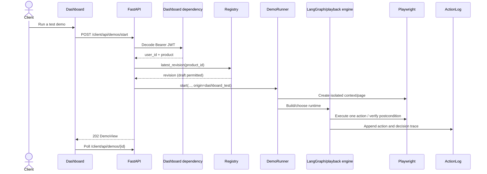

### End User live demo

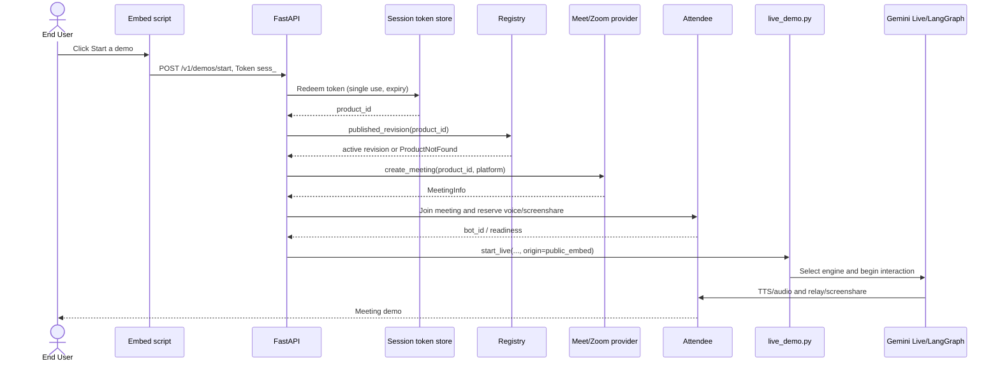

### Autonomous exploration and ambiguous field

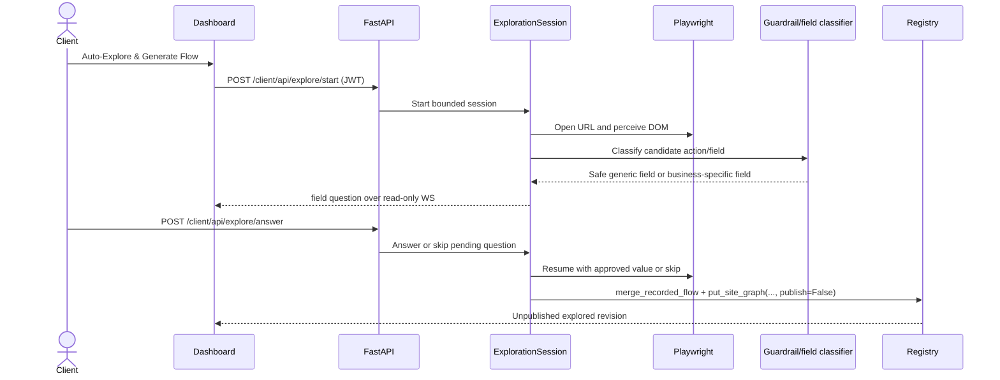

### Self-healing

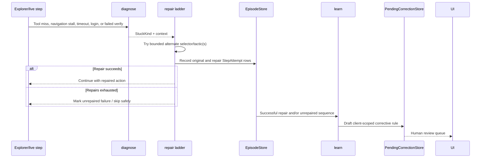

## 7. Error handling and learning

Exploration classifies failures such as element not found, navigation stalled, timeout, login/session interruption, and other browser/tool failures. A repair attempt is triggered only for repairable categories and remains bounded by `max_repairs_per_step` and `max_repairs_total`. Guardrail-flagged risky controls are not bypassed automatically.

Every original attempt and repair attempt is represented by `StepAttempt`. Episodes record the element key, selector, tool, tactic, failure kind, result, timing, and URLs before/after. Unrepaired failures may save capped screenshots. Finalization writes stop reason, budgets, counts, repair successes, unrepaired failures, and failure-kind tallies.

`learn.draft_rules()` uses successful repair sequences and unrepaired failures to ask the configured text provider for a specific corrective rule. The rule is inserted into `PendingCorrectionStore`, not directly into Chroma. After Client review/approval, the correction can enter product-scoped semantic retrieval and influence later exploration/reflection. This review gate prevents one bad LLM inference from silently rewriting future behavior.

Live ActionLog failures are available to product failure queries and reflection. The same `product_id` scope allows a Client’s repeated live mistakes to become correction candidates without crossing tenant boundaries.

## 8. Concurrency and consistency

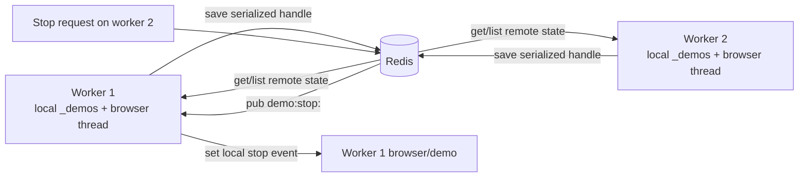

The runner starts a synchronization loop that periodically saves local handles. Redis stores the serialized public handle, a product index, and an owner key. A stop request looks up the owner and publishes to that worker’s channel. The owning process sets the local `threading.Event`; Redis does not remotely control Playwright directly.

Consistency is therefore eventual for status polling. The durable run/action tables remain the audit source, while Redis is ephemeral and expires demo handles after 24 hours. Without Redis, the in-memory fallback is suitable for single-process operation but not reliable multi-worker visibility.

## 9. Testing strategy and remediation checklist

Coverage is broad and organized by behavior: route/auth boundaries, origins and revisions, registry, site graph validation, LangGraph nodes, narration/playback, live input, browser cursor/tools/verification, recording, exploration, repair/episodes, memory, Attendee, meeting providers, voice/STT/TTS, dashboard panels, metrics, and multi-worker runner behavior.

The latest available virtualenv run was:

```text
158 passed, 20 failed, 1 warning in 42.55s
```

The command stopped at `--maxfail=20`, so it is not a complete count of all possible failures.

| Test area | Observed failure | Classification/remediation |
|---|---|---|
| `tests/test_action_log.py` metrics | Metrics returned zero because action rows had no corresponding `demo_runs` rows under the new origin-exclusion query. | Likely stale fixtures after the origin/billing model change. Update fixtures to create explicit live/test run rows; retain a regression test for missing-run billing semantics. |
| `tests/test_client_dashboard.py` run listing | Dashboard run list returned zero for an inserted run. | Likely stale fixture/date assumptions or the same run-query/origin migration issue. Reproduce with current date handling and explicit origin. |
| `tests/test_demo_origin_boundaries.py` live starts | Public live starts returned `422 Demo not ready: Attendee not reachable`. | Environment/infrastructure dependency in the test harness, not evidence that origin selection is wrong. Mock Attendee readiness/provider before asserting revision/origin behavior. |
| `tests/test_demos_start.py` meeting/runner tests | Multiple failures cascaded from Attendee reachability, preventing provider and runner assertions from executing. | Fixture regression: fake provider is installed but readiness is checked earlier. Restore a deterministic Attendee health stub or isolate provider-contract tests from live readiness. |
| Stale dashboard tests | Known by project brief. | Update expected UI/API copy and test-vs-live labels to current product model. |
| Stale OpenAPI spec test | Known by project brief. | Regenerate API docs/spec with `python -m navigator.docs build` after route/schema changes, then update generated expectations. |
| Relay test missing `getUserMedia` | Known by project brief. | Add/restore media-device setup in the relay fixture; classify as fixture deficiency unless browser behavior still fails. |
| Flaky timing test | Known by project brief. | Stabilize with event-based synchronization and bounded polling; do not loosen assertions without identifying the race. |

### Verification checklist

1. Run the full virtualenv suite without `--maxfail` and record the complete failure list.
2. Run origin, registry, metrics, runner multi-worker, and exploration-repair tests independently.
3. Verify Mermaid fences and route names against `navigator/app/main.py`.
4. Run the documentation generator only if API docs are changed; these architecture documents do not replace generated OpenAPI output.
5. Treat external Attendee/Meet/Zoom tests separately from deterministic unit/contract tests.

## 10. Appendix: known bugs and open questions

- **Zoom screenshare:** Attendee’s Zoom path can be unreliable even though the code reserves resources, probes tunnel reachability, and retries screenshare activation.
- **Meet avatar:** the relay contains an avatar/camera-page seam and the repository includes a GLB asset, but the 3D avatar is not yet reliably appearing in the Meet video feed.
- **Embed key leak risk:** the intended design uses server-minted `sess_` tokens, but secure production embedding, token delivery, CORS, and origin policy remain underdesigned. A `nav_` key must never be shipped to the browser.
- **Gemini Live synchronization:** the LangGraph engine has an explicit narration/action ordering fix; whether Gemini Live has the same `SPEAKING`/`EXECUTING` desynchronization remains unconfirmed.
- **Redis/state store:** there are two similarly named state-store modules and the runner still depends on a local cache plus process-owned browser threads. Canonicalization and a durable distributed worker model remain open.
- **Product Map:** persistence and semantic area helpers exist, but the complete automatic roadmap workflow is not considered shipped.

## 11. Open questions

- What is the formal end-to-end latency target for live voice turns?
- Which meeting provider should be the production default, and what availability contract does Attendee need to meet?
- Should live demos fail when screenshare does not become visible, or continue with audio-only behavior?
- What is the approved secure architecture for Client-side token minting and cross-origin embedding?
- What durable queue/worker model will replace process-owned Playwright threads at larger scale?
- Which failing tests are intentionally stale and which expose regressions after the infrastructure fixtures are corrected?
