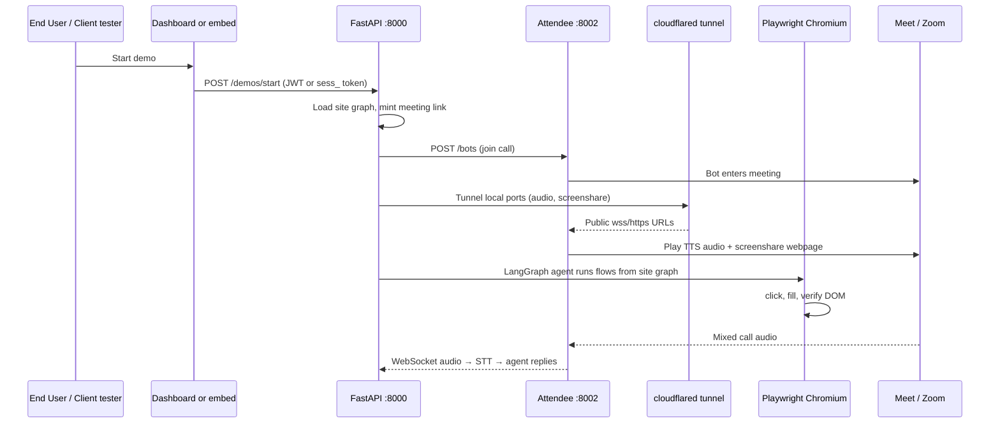

# Quick developer onboarding

**Canonical deep guide:** [`DEVELOPER_ONBOARDING.md`](DEVELOPER_ONBOARDING.md)<br>
(folders, backend/frontend relationships, buttons, API flow, runtime behavior,
tests, deployment, and troubleshooting).

**Broad project map:** [`../README.md`](../README.md)<br>
(product rules, setup, Attendee, VPS, environment variables, and coding workflow).

**Product law (read before any change):** [`PRODUCT_MODEL.md`](PRODUCT_MODEL.md)

This file keeps a short live-demo picture. Prefer the README for day-one setup.

---

## End-to-end flow (one live demo)



## Minimal first run

```bash
python3 -m venv .venv && .venv/bin/pip install -e ".[dev]"
.venv/bin/python -m playwright install chromium
cp .env.example .env   # fill Groq, Gemini, Attendee key, CREDENTIAL_KEY

# Attendee (separate clone) — see README §12
# then:
.venv/bin/uvicorn navigator.app.main:app --port 8000 --workers 1
# open http://127.0.0.1:8000/client
```

**Ports:** Navigator `8000` · Attendee streamer `8001` · Attendee API `8002`.

**Always `--workers 1`.** Live demo state is in-process.

For VPS/nginx, tunnel path, Chroma cache, and full gotchas → **README**.
