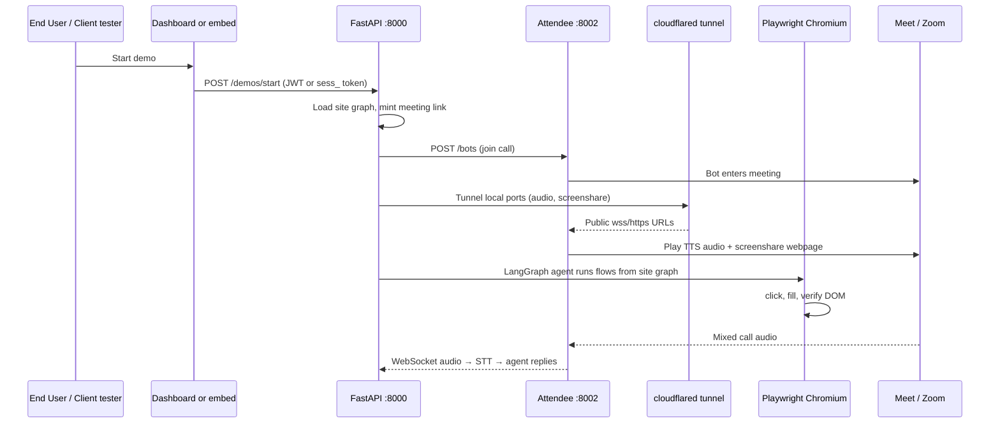

# Developer onboarding

**What Navigator is:** a B2B platform (Resiliencesoft) that lets a **Client** (tenant)
embed a **"Start a demo"** button on their landing page. An **End User** clicks it,
joins a video call, and an AI agent **drives the Client's real web app** in Chromium,
narrates out loud, and answers questions. Navigator is invisible infrastructure — the
visitor sees the Client's product, not our brand.

**Product rules** (auth, billing, draft vs publish): read [`PRODUCT_MODEL.md`](PRODUCT_MODEL.md)
first. This doc is **how the system works** and **how to run/code it**.

---

## End-to-end flow (one live demo)



**In plain terms:**

1. **Auth boundary** picks `origin`: dashboard JWT → `dashboard_test` (not billed);
   embed token → `public_embed` (billed). `product_id` always from the credential.
2. **Site graph** (YAML) describes pages, CSS selectors, and click/fill flows — the
   only product-specific config. No hardcoded product UI in core code.
3. **Meeting link** is created per session (open Meet space, Zoom via ZAK, or static
   `.env` link for local host-admit testing).
4. **Attendee** is a separate Django app that joins the call as a bot: speaks WAV
   audio, shares a URL as video, streams meeting audio back.
5. **cloudflared** exposes localhost to Attendee (screenshare relay, audio WebSocket,
   Zoom ZAK callback) when `NAVIGATOR_PUBLIC_BASE_URL` is unset.
6. **Playwright** runs headful/headless Chromium; the LangGraph agent in
   `navigator/agent/` executes flow steps and logs every action to SQLite.
7. **Voice:** Gemini Live TTS out (English + Hindi, Indian female voice); Groq Whisper STT in on live audio.

---

## Stack at a glance

| Piece | Tech | Port / path | Role |
|---|---|---|---|
| **API + dashboard server** | FastAPI, uvicorn | **8000** | `/v1/*` public API, `/client/*` dashboard API, serves built React |
| **Dashboard UI** | React, Vite, Tailwind | `navigator/client/web` → `dist/` | Client configures graphs, runs test demos, views logs |
| **Demo runner** | `DemoRunner` in-memory + SQLite | — | One worker; starts demo threads |
| **Agent** | LangGraph | `navigator/agent/` | Planning, intake Q&A, flow execution |
| **Browser** | Playwright Chromium | — | Real clicks on Client product |
| **Attendee** | Self-hosted Django (separate repo) | **8002** API, **8001** streamer | Meeting bot join/speak/screenshare |
| **Tunnel** | cloudflared quick tunnel | ephemeral `*.trycloudflare.com` | Attendee reaches your laptop/VPS |
| **Memory** | Chroma | `chroma/` | Product knowledge + corrections |
| **Logs** | SQLite ActionLog | `navigator.db` | Per-action audit trail |

**Attendee is free when self-hosted** (no cloud bill). It is **not** vendored in this
repo — clone [attendee-labs/attendee](https://github.com/attendee-labs/attendee) to
`~/projects/attendee` (or set `NAVIGATOR_ATTENDEE_COMPOSE_DIR`).

---

## Backend map (where code lives)

Code is organized **by feature** under `navigator/`:

| Package | You touch it when… |
|---|---|
| `navigator/app/` | Routes, registry, demo runner, auth — **`main.py` is the entry** |
| `navigator/agent/` | Conversation graph, planning, live Q&A nodes |
| `navigator/automation/` | Playwright tools, flow recorder, explore runner |
| `navigator/meeting/` | Attendee client, live demo orchestration, tunnels, Zoom ZAK |
| `navigator/knowledge/` | Site graph parser, demo script composer, Chroma memory |
| `navigator/client/` | Dashboard backend helpers + **`web/` React app** |
| `navigator/voice/` | TTS (Gemini Live; Fish/Piper legacy fallback), STT hooks, language switch |
| `navigator/logs/` | ActionLog schema and queries |
| `navigator/core/` | `settings.py`, shared Pydantic schemas |

**Important modules:**

- `navigator/app/main.py` — all HTTP routes; `_run_live_demo()` is the shared path
  for test and live demos.
- `navigator/app/runner.py` — `DemoRunner.start_live()` spawns the meeting thread.
- `navigator/meeting/live_demo.py` — join Meet/Zoom, tunnel, screenshare, agent loop.
- `navigator/meeting/attendee_stack.py` — **auto-starts** local Attendee on API boot.
- `navigator/knowledge/site_graph.py` — YAML → typed graph; flows and selectors.

---

## Dashboard UI map

Built to `navigator/client/web/dist/` and served by FastAPI at `/client` (loopback only).

| Panel | File | Calls |
|---|---|---|
| Auth | `panels/AuthScreen.tsx` | `/client/api/auth/*` |
| Overview / metrics | `panels/Overview.tsx` | `/client/api/metrics`, runs |
| Site graph editor | `panels/Editors.tsx` | `/client/api/site-graph`, demo-script |
| Flow recorder | `panels/Flows.tsx` | `/client/api/recorder/*` |
| **Test demo** | `panels/LiveDemo.tsx` | `POST /client/api/demos/start` |
| Logs | `panels/Logs.tsx` | `/client/api/runs/*/events` |
| Resource monitor | `panels/ResourceMonitor.tsx` | `/client/api/system/health` |

State: Zustand in `store.ts`; demo polling in `lib/demoSession.ts`. API client:
`lib/api.ts` (JWT in memory, refresh via cookie).

**UI dev** (hot reload while editing components):

```bash
cd navigator/client/web && npm install && npm run dev
```

Backend must already run on `:8000`; Vite proxies API calls.

---

## Meeting platforms (dashboard test demo)

| Platform | Behavior |
|---|---|
| **Google Meet (new space)** | API creates open room; bot joins first (`bot_first=True`). Best for hands-free. |
| **Zoom** | Navigator hosts via ZAK callback; needs Zoom creds in Attendee + Navigator `.env`. |
| **Static Meet (.env)** | Reuses `NAVIGATOR_MEETING_URL`; **you** are host and must **admit** the bot. |

Bot never admits itself — open rooms or host admit only. See logs for
`[live] bot in meeting` when join succeeded.

---

## First-time setup

```bash
# 1. Python
python3 -m venv .venv
.venv/bin/pip install -e '.[api,voice,memory,llm,dev]'
.venv/bin/playwright install chromium

# 2. Config
cp .env.example .env
# Minimum for live demo: GROQ (STT), GEMINI (TTS + vision), ATTENDEE_API_KEY, CREDENTIAL_KEY

# 3. Attendee clone (once)
git clone https://github.com/attendee-labs/attendee ~/projects/attendee
cd ~/projects/attendee
python init_env.py > .env   # edit POSTGRES_SSL_REQUIRE=false, DISABLE_EMAIL=true, etc.
# See root README "Self-hosting Attendee" for full compose setup

# 4. Attendee API key — create account at http://localhost:8002 after first boot
# Put key in Navigator .env as NAVIGATOR_ATTENDEE_API_KEY
#
# Voice agents (required for Meet screenshare): Navigator syncs docker/attendee-local.docker-compose.yaml
# into the Attendee clone (ENABLE_VOICE_AGENTS=true). After clone or upgrade:
#   ./scripts/sync-attendee-compose.sh
#   cd ~/projects/attendee && docker compose -f dev.docker-compose.yaml -f local.docker-compose.yaml \
#     --profile webpage-streamer up -d --force-recreate
```

**Docker:** user must be in `docker` group (`sudo usermod -aG docker $USER`, re-login)
or prefix commands with `sg docker -c "..."`.

---

## Running

```bash
.venv/bin/uvicorn navigator.app.main:app --port 8000 --workers 1
```

Open **`http://127.0.0.1:8000/client`**. Use **`--workers 1`** — live demo state is
in-process (`DemoRunner`).

**Attendee autostart:** on boot, if `NAVIGATOR_ATTENDEE_BASE_URL` is localhost and
`NAVIGATOR_ATTENDEE_AUTOSTART=1` (default), Navigator runs `docker compose up -d` in
the Attendee clone and waits until `:8002` answers. Logs:

```
[attendee] starting docker stack in ~/projects/attendee…
[attendee] ready at http://localhost:8002/api/v1
```

Disable with `NAVIGATOR_ATTENDEE_AUTOSTART=0`. Cloud Attendee URL skips docker.

**Tests:**

```bash
.venv/bin/python -m pytest -q
```

---

## Coding workflow

1. Read `PRODUCT_MODEL.md` before changing auth, origins, or publish behavior.
2. Put new code in the matching feature package (table above) — not `navigator.api`
   or other legacy names.
3. After Python changes under `navigator/`:
   ```bash
   graphify update .
   ```
4. After API/route changes:
   ```bash
   .venv/bin/python -m navigator.docs build
   npx fern-api check
   ```
5. Site graph changes: edit YAML in dashboard or `navigator/knowledge/sites/` (fixtures
   only for tests — live demos need a real Client graph).

**Typical tasks:**

| Task | Start here |
|---|---|
| New API route | `navigator/app/main.py` |
| Demo lifecycle / status | `navigator/app/runner.py` |
| Agent behavior | `navigator/agent/nodes/` |
| Playwright step | `navigator/automation/` |
| Meet join / screenshare bug | `navigator/meeting/live_demo.py` |
| Dashboard button / panel | `navigator/client/web/src/panels/` |
| Compose spoken script | `navigator/knowledge/demo_script.py` |

---

## Key environment variables

| Variable | Purpose |
|---|---|
| `NAVIGATOR_ATTENDEE_BASE_URL` | Attendee API (`http://localhost:8002/api/v1` local) |
| `NAVIGATOR_ATTENDEE_API_KEY` | Token from Attendee UI |
| `NAVIGATOR_ATTENDEE_AUTOSTART` | `1` = docker up on Navigator boot (local only) |
| `NAVIGATOR_ATTENDEE_COMPOSE_DIR` | Path to Attendee clone (default `~/projects/attendee`) |
| `NAVIGATOR_GROQ_API_KEY` | Live STT + text LLM (flow pick, phrasing) |
| `NAVIGATOR_GEMINI_API_KEY` | Gemini Live TTS, vision turn brain, reflection |
| `NAVIGATOR_GEMINI_LIVE_VOICE` | Prebuilt voice name (default `Sulafat` — warm female) |
| `NAVIGATOR_DEFAULT_SPOKEN_LANGUAGE` | `en` (default) or `hi`; prospect can switch by voice |
| `NAVIGATOR_FISH_API_KEY` | Legacy TTS fallback when Gemini key unset |
| `NAVIGATOR_MEETING_URL` | Static Meet link for `platform=static` |
| `NAVIGATOR_PUBLIC_BASE_URL` | Stable public origin for Zoom ZAK; empty → auto-tunnel |
| `NAVIGATOR_CREDENTIAL_KEY` | Fernet key for Client product login vault |

Full list: `.env.example`.

---

## Gotchas

| Symptom | Cause / fix |
|---|---|
| `Attendee unreachable` | Docker down, wrong compose files, or autostart path wrong |
| `400 Voice agents are not enabled` | Run `./scripts/sync-attendee-compose.sh` then recreate Attendee stack (see below) |
| Bot stuck "joining" on static Meet | Admit bot as host, or enable Meet Quick access |
| Demo dies mid-start with `--reload` | File save triggers uvicorn reload; use plain uvicorn for live tests |
| Screenshare NXDOMAIN | Attendee streamer container DNS — see `navigator/meeting/tunnel.py` |
| Zoom 400 "credentials required" | Add Zoom app creds in Attendee project UI |
| Attendee email links say `:8000` | Open on `:8002` (Attendee dev settings quirk) |
| `*.md` won't commit | Repo gitignores docs; `ONBOARDING.md` is explicitly un-ignored |
| Test demo counts as billing | It shouldn't — `origin=dashboard_test` excluded from metrics |

---

## Docker

Run Navigator in a container (Playwright Chromium + built dashboard + cloudflared).
Attendee stays **separate** — start it on the host (or another compose stack) and point
Navigator at it.

```bash
cp .env.example .env   # fill keys; Attendee API key required for live demos

docker compose build
docker compose up -d

# Full stack (live demo: VAD, Chroma, Piper) — slower build, CPU torch only:
# docker compose build --build-arg NAVIGATOR_EXTRAS=full

# Dashboard (loopback only — use localhost, not 0.0.0.0 hostname)
open http://127.0.0.1:8080/client
```

| Setting | Docker default | Why |
|---|---|---|
| `NAVIGATOR_HEADFUL` | `0` | headless Chromium in container |
| `NAVIGATOR_ATTENDEE_AUTOSTART` | `0` | no Docker-in-Docker; run Attendee on host |
| `NAVIGATOR_ATTENDEE_BASE_URL` | `http://host.docker.internal:8002/api/v1` | reach host Attendee from container |
| Host port | **8080** → container 8000 | Attendee dev stack often binds host `:8000`; change `ports` in `docker-compose.yml` if free |
| DB / Chroma / vault | `/data/*` volume | persists across restarts |

**Attendee on host** (while Navigator runs in Docker):

```bash
cd ~/projects/attendee
docker compose -f dev.docker-compose.yaml -f local.docker-compose.yaml \
  --profile webpage-streamer up -d
```

Optional Redis (multi-worker coordination later):

```bash
docker compose --profile redis up -d
# set NAVIGATOR_REDIS_URL=redis://redis:6379/0 in .env or compose environment
```

Logs: `docker compose logs -f navigator` · Stop: `docker compose down`

---

## Quick reference

```bash
# Backend (local venv)
.venv/bin/uvicorn navigator.app.main:app --port 8000 --workers 1

# Backend (Docker)
docker compose up -d

# Frontend dev
cd navigator/client/web && npm run dev

# Attendee manual (if autostart off)
cd ~/projects/attendee
docker compose -f dev.docker-compose.yaml -f local.docker-compose.yaml \
  --profile webpage-streamer up -d

# Docs regen
.venv/bin/python -m navigator.docs build && npx fern-api check
```

**Ports:** Navigator `8000` · Attendee streamer `8001` · Attendee API `8002` · MinIO `9000`.
